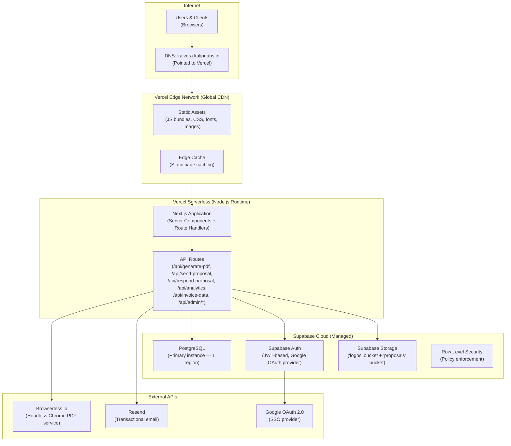

# Kalvora — Infrastructure & Deployment

> Part of the Kalvora System Design docs · See also: [kalvora-system-design.md](./kalvora-system-design.md)

This document covers the hosting infrastructure, deployment configuration, environment variables, build pipeline, and what to consider when evolving Kalvora's infrastructure.

---

## Current Infrastructure Stack



---

## Hosting Platform: Vercel

**What Vercel provides:**
- **Static CDN:** All Next.js build output (JS bundles, CSS, fonts, public images) served globally from Vercel's edge nodes. Sub-20ms response times worldwide.
- **Serverless Functions:** Next.js API Routes (`/api/*`) run as serverless Node.js functions — auto-scale horizontally, no server management.
- **Server Components:** Next.js Server Components render on Vercel's Node.js runtime and stream HTML to clients.
- **Automatic HTTPS:** TLS certificates managed automatically via Let's Encrypt.
- **Preview Deployments:** Every git push creates a unique preview URL (if connected to GitHub).

**Next.js Configuration (`next.config.mjs`):**
```javascript
const nextConfig = {
    reactStrictMode: false,  // Disabled to prevent double-render in development
};
```
This is a minimal configuration — no custom rewrites, redirects, or image domains configured. The only setting is `reactStrictMode: false`, which prevents Strict Mode's development-only double-invocation of effects.

---

## DNS Configuration

| Record Type | Host | Points To |
|-------------|------|-----------|
| CNAME | `kalvora.kaliprlabs.in` | `cname.vercel-dns.com` |
| (or) A | `kalvora.kaliprlabs.in` | Vercel IP addresses |

Managed at `kaliprlabs.in` domain registrar/DNS provider (not configured in this codebase).

**Short link domain:** `kalvora.kaliprlabs.in/p/KV-xxxxx` and `/i/KV-xxxxx` — served by the same Next.js app via dynamic routes.

---

## Environment Variables

All environment variables are set in Vercel's project settings (for production) and `.env.local` file (for local development).

### Complete Variable Reference

| Variable | Prefix | Required | Secret | Description |
|----------|--------|----------|--------|-------------|
| `NEXT_PUBLIC_SUPABASE_URL` | `NEXT_PUBLIC_` | ✅ Yes | ❌ No | Supabase project URL (safe to expose — limited by RLS) |
| `NEXT_PUBLIC_SUPABASE_ANON_KEY` | `NEXT_PUBLIC_` | ✅ Yes | ❌ No | Supabase anonymous key (safe to expose — RLS prevents unauthorized access) |
| `SUPABASE_SERVICE_ROLE_KEY` | — | ✅ Yes | ✅ **YES** | Supabase superuser key — bypasses ALL RLS. Server-side only. |
| `BROWSERLESS_API_TOKEN` | — | ✅ Yes | ✅ **YES** | Browserless.io API token for PDF generation |
| `RESEND_API_KEY` | — | ✅ Yes | ✅ **YES** | Resend transactional email API key |
| `NEXT_PUBLIC_APP_URL` | `NEXT_PUBLIC_` | ✅ Yes | ❌ No | Production base URL (e.g. `https://kalvora.kaliprlabs.in`). Used in email links and short URL construction. |
| `ADMIN_EMAILS` | — | Optional | ❌ No | Server-side comma-separated admin email allowlist. Used in `/api/admin/*` route verification. |
| `NEXT_PUBLIC_ADMIN_EMAILS` | `NEXT_PUBLIC_` | Optional | ❌ No | Client-side admin email allowlist. Used by `AdminGuard.tsx` for UI protection. |

### `NEXT_PUBLIC_` vs. Non-prefixed Variables

Next.js **only** exposes environment variables prefixed with `NEXT_PUBLIC_` to client-side bundles. Variables **without** this prefix are exclusively available in server-side code (API routes, Server Components).

**This is how Kalvora prevents secret key exposure:**
- `SUPABASE_SERVICE_ROLE_KEY` — no prefix → never in browser bundle → safe
- `BROWSERLESS_API_TOKEN` — no prefix → never in browser bundle → safe
- `RESEND_API_KEY` — no prefix → never in browser bundle → safe

**Verification:** Run `grep -r "SUPABASE_SERVICE_ROLE_KEY" src/` — it should only appear in `src/lib/supabase.ts` inside `createServerClient()`, which is only called from API routes.

---

## Build Pipeline

### Local Development

```bash
npm run dev
# → next dev
# → TypeScript compilation (incremental)
# → Hot Module Replacement (HMR)
# → Available at http://localhost:3000
```

### Production Build

```bash
npm run build
# → next build
# → TypeScript type checking
# → Static page generation (SSG where applicable)
# → Server Component optimization
# → Client bundle splitting and tree-shaking
# → Output: .next/ directory

npm run start
# → next start
# → Serves production build locally (for testing)
```

### Build Output Analysis (`build_output.txt`, `build_output3.txt`)

The repository contains captured build output files showing the compiled page sizes:

Key observations from the build output:
- `page.tsx` (landing + LoggedInHome) is 38KB source → significant client bundle due to the full sales page
- `create/page.tsx` is 53KB → large form with all 8 sections
- `templates.ts` is 50KB → large but only loaded server-side in the PDF API route
- API routes compile to small serverless bundles

---

## Supabase Database Setup

### Migration Order

Supabase migrations are applied **manually** via the Supabase Dashboard SQL Editor in this order:

```
1. supabase/migration.sql              → Base schema (projects, rooms, line_items, proposals)
2. supabase/auth_migration.sql         → Add user_id to projects, RLS policies
3. supabase/profile_migration.sql      → designer_profiles table
4. supabase/feedback_migration.sql     → feedback table
5. supabase/approval_migration.sql     → client_viewed_at, comments table
6. supabase/invoice_profile_migration.sql → GST/bank fields on designer_profiles
7. supabase/cascade_delete_migration.sql  → ON DELETE CASCADE for projects.user_id
8. supabase/payment_milestones_migration.sql → payment_milestones table
9. supabase/short_links_migration.sql  → short_codes table + expanded RLS policies
```

**Important:** There is no automated migration runner (no Supabase CLI integration, no CI/CD that runs migrations). Each migration file must be run manually in sequence. Running them out of order or re-running already-applied migrations is safe due to `IF NOT EXISTS` and `IF EXISTS` guards.

### Storage Bucket Setup

Two public buckets must be manually created in Supabase Dashboard → Storage:

| Bucket | Visibility | Contents |
|--------|-----------|----------|
| `logos` | Public | Designer studio logo images |
| `proposals` | Public | Generated PDF proposal files |

**Public means:** Anyone with the URL can access the file — no JWT required. This is intentional since PDFs are sent to clients who aren't logged in.

---

## Deployment Checklist

When deploying a new version of Kalvora, verify:

- [ ] All required environment variables set in Vercel project settings
- [ ] Supabase migrations applied in correct order
- [ ] Storage buckets (`logos`, `proposals`) created and set to public
- [ ] Google OAuth redirect URI configured in Supabase Auth settings for production domain
- [ ] `NEXT_PUBLIC_APP_URL` set to production URL (not localhost)
- [ ] `ADMIN_EMAILS` and `NEXT_PUBLIC_ADMIN_EMAILS` match for the admin user
- [ ] Browserless.io API token is valid and has sufficient quota
- [ ] Resend domain `kalvora.kaliprlabs.in` is verified for sending

---

## Local Development Setup

```bash
# 1. Clone repository
git clone https://github.com/pratikanpat/Kalvora.git
cd Kalvora

# 2. Install dependencies
npm install

# 3. Create environment file
cp .env.local.example .env.local
# Edit .env.local with your credentials

# 4. Apply database migrations (in Supabase Dashboard SQL Editor)
# Run each file in /supabase/ in the order listed above

# 5. Create storage buckets in Supabase Dashboard
# Storage → New Bucket → "logos" (Public)
# Storage → New Bucket → "proposals" (Public)

# 6. Start development server
npm run dev
# → http://localhost:3000
```

---

## Infrastructure Evolution Roadmap

### Phase 1: Observability (Immediate)

Add before anything else — you can't improve what you can't see.

```bash
# Add Sentry for error tracking
npm install @sentry/nextjs

# Add OpenTelemetry for distributed tracing
npm install @opentelemetry/api @opentelemetry/sdk-node
```

Sentry integration points:
- All `/api/*` route `catch` blocks: `Sentry.captureException(error)`
- `AuthProvider.tsx`: capture auth recovery failures
- PDF generation failures: high priority alert

### Phase 2: Rate Limiting (Urgent for Security)

```bash
npm install @upstash/ratelimit @upstash/redis
```

Add to `middleware.ts` (currently doesn't exist):
```typescript
// Protect expensive endpoints
const rateLimiter = new Ratelimit({
    redis: Redis.fromEnv(),
    limiter: Ratelimit.slidingWindow(10, '60 s'),
});

// Apply to: /api/generate-pdf, /api/respond-proposal, /api/send-proposal
```

### Phase 3: Async PDF Generation

Replace synchronous Browserless call with a job queue:

```
Current:  API call → Browserless (blocks 5-20s) → response
Future:   API call → enqueue job → return { jobId }
          Worker → Browserless → upload → update DB
          Client polls: GET /api/pdf-status?jobId=xxx
```

Tool options: Upstash QStash (simplest), AWS SQS, Inngest.

### Phase 4: Caching Layer

```bash
npm install @upstash/redis
```

Cache targets (in priority order):
1. Short code lookups (`short_codes` table) — immutable after creation, ideal cache
2. Analytics results per user — recompute max every 5 minutes
3. Designer profiles — changes infrequently
4. Public project data for `/view/[id]` — changes only on approval

### Phase 5: CI/CD for Database Migrations

Install Supabase CLI:
```bash
npm install -g supabase
supabase init
supabase link --project-ref {your-project-ref}
```

Convert manual SQL files to Supabase CLI migration format:
```
supabase/migrations/
    20240101_initial_schema.sql
    20240102_auth.sql
    20240103_profiles.sql
    ...
```

Add to deployment pipeline:
```yaml
# .github/workflows/deploy.yml
- name: Apply DB migrations
  run: supabase db push
  env:
    SUPABASE_ACCESS_TOKEN: ${{ secrets.SUPABASE_ACCESS_TOKEN }}
```

---

## Security Hardening Checklist

Current gaps to address:

- [ ] **Content Security Policy (CSP) headers** — Add via `next.config.mjs` `headers()` function
- [ ] **Rate limiting** — Protect all API routes (especially PDF generation)
- [ ] **Admin auth hardening** — Replace email allowlist with proper role field in `auth.users.raw_user_meta_data`
- [ ] **API input size limits** — Limit request body sizes to prevent memory exhaustion
- [ ] **Storage URL expiry** — Consider signed (expiring) URLs for PDF storage instead of public permanent URLs
- [ ] **Dependency audit** — Run `npm audit` regularly; automate with Dependabot
- [ ] **Environment variable scanning** — Ensure no secrets in git history; add pre-commit hooks

---

*Part of Kalvora System Design Docs · [Back to Main Document](./kalvora-system-design.md)*
