# Kalvora — Complete System Design Document

> **Version:** 12.0.0 · **Last Reviewed:** 2026-05-31  
> **Audience:** Engineers, architects, and technical contributors to the Kalvora codebase  
> **Repository:** `c:/Users/Pratik/Documents/VSCode/Kalvora`

---

## 1. Executive Summary

### What is Kalvora?

**Kalvora** (internal package name: `proposalflow`) is a SaaS web application built for **interior designers and small interior design studios** — primarily in the Indian market — to replace their chaotic, manual quotation workflow with a streamlined, professional one.

Interior designers traditionally create quotations in Word, Excel, or even WhatsApp messages. Kalvora gives them a guided, multi-section form to fill in client info, project details, rooms, services, pricing, and timeline — and then instantly generates a beautifully branded PDF proposal they can share with a client via a short magic link.

### Who Uses It

| User Type | How They Use Kalvora |
|-----------|---------------------|
| **Interior Designer (Primary)** | Creates proposals, manages studio profile, tracks project status, views client activity, generates invoices |
| **Client (End Consumer)** | Receives a magic link, views the proposal, approves or requests changes, receives invoice |
| **Kalipr Labs Admin** | Accesses the hidden `/admin` dashboard to monitor users, proposals, and product feedback |

### Core Business Workflow

```
Designer Signs Up
       ↓
Sets Up Studio Profile (logo, branding, tax/bank details)
       ↓
Creates a Proposal (8-section guided form at /create)
       ↓
Generates a PDF (via Browserless API → uploaded to Supabase Storage)
       ↓
Shares Short Link with Client  (e.g. kalvora.kaliprlabs.in/p/KV-R7x3mQ)
       ↓
Client Opens Link → Proposal Viewed (client_viewed_at timestamp set)
       ↓
Client Approves OR Requests Changes (via /view/[id])
       ↓
On Approval:
  → Payment milestones auto-created (30% / 40% / 30%)
  → Designer notified via email (Resend)
  → Client receives invoice link (/invoice/[id]) via email
       ↓
Designer Marks Milestones as Paid
       ↓
Project Completed
```

### Main Features

| Feature | Description |
|---------|-------------|
| 🎨 **6 Premium PDF Templates** | Minimal, Luxury, Modern, Blueprint, Editorial, High Contrast |
| 📄 **Instant PDF Generation** | Browserless.io REST API converts HTML templates to A4 PDFs in seconds |
| 🔗 **Smart Short Links** | `KV-xxxxx` short codes for proposals (`/p/`) and invoices (`/i/`) |
| 👁️ **View Tracking** | `client_viewed_at` timestamp set when the magic link is first opened |
| ✅ **Client Approval Workflow** | Approve, request changes, persistent discussion comments |
| 💰 **Payment Milestones** | 30/40/30 auto-split or custom milestones per project |
| 🧾 **Auto-Invoicing** | GST-compliant invoice page auto-generated after client approval |
| 📧 **Automated Emails** | Resend integration for proposal delivery, approval, and invoice notifications |
| 🏢 **Studio Profiles** | Logo, branding, GSTIN, PAN, bank details, UPI ID — auto-populated into all documents |
| 📊 **Analytics Strip** | Total proposals, approval rate, avg deal size, active projects — per-user |
| 🔐 **Admin Dashboard** | Hidden `/admin` with user list, feedback viewer, platform metrics |

---

## 2. High-Level Architecture

### System Architecture Diagram

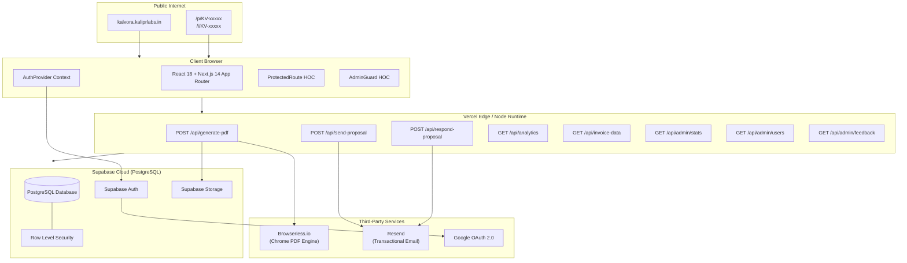

### Technology Stack Map

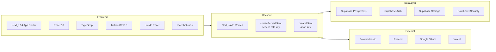

---

## 3. Complete Request Flows

### 3.1 — Proposal Creation Flow

```
Designer fills /create form (8 sections)
         ↓
[Client] Page state: project data, rooms[], lineItems[]
         ↓
Click "Generate & Send"
         ↓
[Client] INSERT INTO projects (status='Draft') → supabase.anon
[Client] INSERT INTO rooms (multiple) → supabase.anon
[Client] INSERT INTO line_items (multiple) → supabase.anon
         ↓
[Client] POST /api/generate-pdf { project_id }
         ↓
[Server] createServerClient() → service role (bypasses RLS)
[Server] SELECT project, rooms, line_items IN PARALLEL
[Server] Pick HTML template from /src/lib/templates.ts
[Server] POST https://chrome.browserless.io/pdf { html, options: A4 }
         ↓
[Browserless] Renders HTML in headless Chrome → returns PDF buffer
         ↓
[Server] PARALLEL:
  → Upload PDF to Supabase Storage (proposals bucket)
  → COUNT existing proposals for project
[Server] PARALLEL:
  → INSERT INTO proposals { project_id, pdf_url }
  → UPDATE projects SET status='Sent' WHERE status='Draft'
         ↓
[Server] Return { pdf_url, download_filename }
         ↓
[Client] SuccessModal shown with download + share links
[Client] getOrCreateShortCode() → INSERT short_codes { KV-xxxxx }
```

### 3.2 — Client Proposal Viewing Flow

```
Client receives email with: kalvora.kaliprlabs.in/p/KV-R7x3mQ
         ↓
Browser loads /p/[code] → ShortProposalRedirect component
         ↓
[Client] resolveShortCode("KV-R7x3mQ")
  → SELECT project_id, link_type FROM short_codes WHERE code = 'KV-R7x3mQ'
         ↓
router.replace("/view/{project_id}")
         ↓
[Client] /view/[id] page loads (NO authentication required)
  → SELECT * FROM projects WHERE id = ? AND status IN ('Sent','Approved','Paid','Completed')
  → SELECT rooms, line_items, proposals, payment_milestones, comments IN PARALLEL
         ↓
[Client] POST /api/respond-proposal { projectId, action: 'viewed' }
  → UPDATE projects SET client_viewed_at = NOW() WHERE id = ?
         ↓
Proposal rendered for client with Approve / Request Changes buttons
```

### 3.3 — Client Approval Flow

```
Client clicks "Approve Proposal" → Confirmation Modal opens
         ↓
Client clicks "Yes, Approve & Get Invoice"
         ↓
[Client] POST /api/respond-proposal {
  projectId, action: 'approve',
  clientName, projectName
}
         ↓
[Server] createServerClient() — service role
[Server] SELECT project { status, user_id, client_email }
[Server] GET designer email via supabase.auth.admin.getUserById(project.user_id)
[Server] GET designer profile email as fallback
         ↓
[Server] UPDATE projects SET status='Approved'
         ↓
[Server] Auto-create payment milestones IF none exist:
  → SELECT line_items → compute grand total with tax
  → INSERT payment_milestones: Advance(30%), Mid(40%), Final(30%)
         ↓
[Server] PARALLEL emails via Resend:
  → Email to designer: "🎉 Proposal Approved by {clientName}"
  → Email to client: "📄 Your Invoice for {projectName}"
    (uses getOrCreateShortCodeServer() → /i/KV-xxxxx invoice link)
         ↓
[Client] Redirect loading overlay: "Preparing Your Invoice..."
[Client] router.push("/invoice/{project_id}")
```

### 3.4 — Authentication Flow

```
User visits /login
         ↓
Enters email + password (OR clicks Google OAuth)
         ↓
[Client] supabase.auth.signInWithPassword({ email, password })
  OR
[Client] supabase.auth.signInWithOAuth({ provider: 'google' })
         ↓
Supabase Auth issues JWT access_token + refresh_token
         ↓
Tokens stored in localStorage (detectSessionInUrl: true for OAuth redirects)
         ↓
AuthProvider.onAuthStateChange fires → SIGNED_IN event
  → applySession(newSession) → user state updated
         ↓
ProtectedRoute renders children (no redirect)
         ↓
page.tsx detects user → renders LoggedInHome (Closing Engine)
```

### 3.5 — PDF Generation Deep Dive

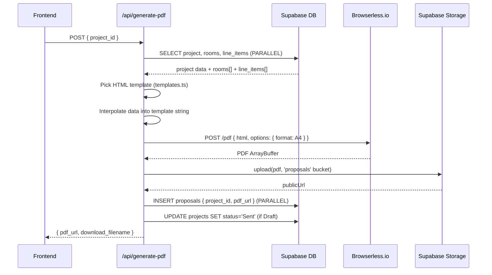

---

## 4. Frontend Architecture

### Framework & Configuration

- **Framework:** Next.js 14 with the **App Router** (file-system routing under `/src/app`)
- **Language:** TypeScript (strict mode)
- **Styling:** TailwindCSS 3 + custom utility classes defined in [`globals.css`](../../src/app/globals.css)
- **Fonts:** Inter (body/UI) + Playfair Display (headings) — loaded via `next/font/google`
- **Rendering Model:** Hybrid — Server Components where possible, Client Components where interactivity is required (`'use client'` directive)

### Routing Map

```
/                       → page.tsx       (auth-aware: Sales Landing OR Closing Engine)
/login                  → login/page.tsx  (Supabase email + Google OAuth)
/signup                 → signup/page.tsx
/forgot-password        → forgot-password/page.tsx
/reset-password         → reset-password/page.tsx
/dashboard              → dashboard/page.tsx    [ProtectedRoute]
/create                 → create/page.tsx       [ProtectedRoute]
/edit/[id]              → edit/[id]/page.tsx    [ProtectedRoute]
/proposals/[id]         → proposals/[id]/...    [ProtectedRoute]
/profile                → profile/page.tsx      [ProtectedRoute]
/completed              → completed/page.tsx    [ProtectedRoute]
/feedback               → feedback/page.tsx     (auth-gated for type tracking)
/public-feedback        → public-feedback/...   (no auth)
/try                    → try/page.tsx          (zero-auth demo)
/view/[id]              → view/[id]/page.tsx    (no auth — public)
/invoice/[id]           → invoice/[id]/page.tsx (no auth — public)
/p/[code]               → p/[code]/page.tsx     (short link redirect → /view/[id])
/i/[code]               → i/[code]/page.tsx     (short link redirect → /invoice/[id])
/admin                  → admin/page.tsx        [AdminGuard]
/admin/feedback         → admin/feedback/...    [AdminGuard]
/admin/users            → admin/users/...       [AdminGuard]
```

### Component Hierarchy

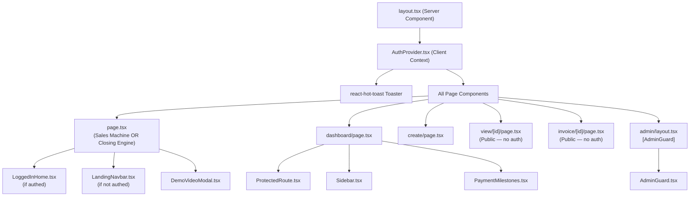

### State Management

Kalvora uses **React's built-in state management** — no Redux, Zustand, or similar:

| State Type | Where Managed | Mechanism |
|-----------|--------------|-----------|
| **Auth session** | `AuthProvider.tsx` | React Context + `useAuth()` hook |
| **Page-level UI state** | Individual pages | `useState` + `useEffect` |
| **Form state** | `create/page.tsx`, `edit/page.tsx` | `useState` (local, not persisted) |
| **Toast notifications** | Anywhere | `react-hot-toast` |
| **Server data** | Pages + components | Direct `supabase.from(...)` calls in `useEffect` |

### Data Fetching Strategy

```mermaid
graph LR
    subgraph ClientSide["Client-Side (anon key)"]
        CS1[Dashboard — fetches own projects]
        CS2[View page — fetches public proposal]
        CS3[Profile page — fetches own designer_profile]
        CS4[Short link — resolves code]
    end

    subgraph ServerSide["Server-Side API Routes (service role)"]
        SS1[/api/generate-pdf — fetches + writes all data]
        SS2[/api/invoice-data — bypasses RLS for invoice page]
        SS3[/api/respond-proposal — reads + writes across users]
        SS4[/api/admin/* — reads all users/projects/feedback]
    end

    CS1 --> AnonKey[Supabase Anon Key]
    CS2 --> AnonKey
    CS3 --> AnonKey
    CS4 --> AnonKey

    SS1 --> ServiceKey[Supabase Service Role Key]
    SS2 --> ServiceKey
    SS3 --> ServiceKey
    SS4 --> ServiceKey
```

**Pattern:** Client components call Supabase directly using the anon key (subject to RLS). API routes use the service role key to bypass RLS for cross-user operations, invoice data, and PDF generation.

### Key Frontend Files

| File | Purpose |
|------|---------|
| [`src/app/layout.tsx`](../../src/app/layout.tsx) | Root layout — wraps every page with `AuthProvider` and `Toaster` |
| [`src/app/page.tsx`](../../src/app/page.tsx) | Entry point — auth-aware; 38KB file containing full sales landing + logged-in home |
| [`src/app/globals.css`](../../src/app/globals.css) | Design system — custom CSS variables, `.glass-card`, `.btn-primary`, `.input-field` |
| [`src/components/AuthProvider.tsx`](../../src/components/AuthProvider.tsx) | Auth context with session recovery logic |
| [`src/components/LoggedInHome.tsx`](../../src/components/LoggedInHome.tsx) | 42KB "Closing Engine" — command center for logged-in users |
| [`src/lib/templates.ts`](../../src/lib/templates.ts) | 50KB file — all 6 HTML/CSS PDF templates as TypeScript string functions |

---

## 5. Backend Architecture

### API Routes Overview

All backend logic lives in Next.js Route Handlers under `/src/app/api/`. There are **no separate backend servers** — everything runs on Vercel's Node.js runtime.

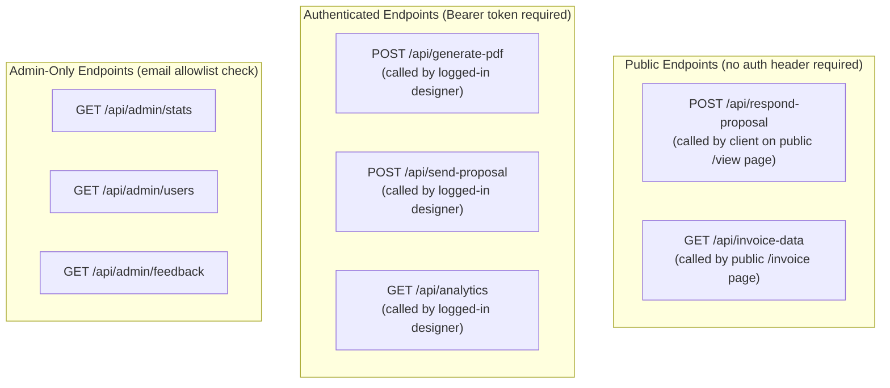

### Supabase Client Duality Pattern

This is the single most important backend pattern in Kalvora:

```typescript
// src/lib/supabase.ts

// BROWSER CLIENT — uses anon key, subject to RLS
// Used by: all client components, hooks, and browser-side code
export const supabase = createClient(url, anonKey, {
    auth: { persistSession: true, autoRefreshToken: true, detectSessionInUrl: true }
});

// SERVER CLIENT — uses service role key, BYPASSES all RLS
// Cached as singleton per server process
// Used by: all API route handlers
export function createServerClient() {
    serverClient = createClient(url, serviceRoleKey);
    return serverClient;
}
```

**Why this matters:** The service role key is a superuser key that bypasses Row Level Security entirely. It should only ever exist in server-side code (API routes), never in client-side bundles. Kalvora correctly uses `SUPABASE_SERVICE_ROLE_KEY` (no `NEXT_PUBLIC_` prefix) ensuring it is never exposed to the browser.

### Middleware & Authorization

There is **no Next.js `middleware.ts`**. Authorization is enforced in two places:

**1. Client-side (UI guards):**
- [`ProtectedRoute.tsx`](../../src/components/ProtectedRoute.tsx) — redirects unauthenticated users to `/`
- [`AdminGuard.tsx`](../../src/components/AdminGuard.tsx) — checks email against `NEXT_PUBLIC_ADMIN_EMAILS`

**2. Server-side (API routes):**
- Analytics route: validates Bearer token via `supabase.auth.getUser(token)`
- Admin routes: validates Bearer token + checks email against `ADMIN_EMAILS` env var
- PDF/send-proposal: no explicit token check — trusts RLS on data access (service role used, but project ownership validated at DB level)

### Error Handling Pattern

All API routes follow this consistent pattern:

```typescript
export async function POST(request: Request) {
    try {
        // Input validation
        const { projectId } = await request.json();
        if (!projectId) return NextResponse.json({ error: '...' }, { status: 400 });

        // Business logic
        // ...

        return NextResponse.json({ success: true });
    } catch (error) {
        console.error('API error:', error);
        return NextResponse.json(
            { error: error instanceof Error ? error.message : 'Internal server error' },
            { status: 500 }
        );
    }
}
```

### Validation Layer

[`src/lib/validators.ts`](../../src/lib/validators.ts) provides centralized validators:

| Validator | Format Enforced |
|-----------|----------------|
| `validateEmail` | Standard email regex |
| `validatePhone` | Indian 10-digit mobile (6–9 prefix) |
| `validateGSTIN` | 15-char Indian GST (e.g. `27AABCU9603R1ZM`) |
| `validatePAN` | 10-char Indian PAN (e.g. `ABCDE1234F`) |
| `validateIFSC` | 11-char bank code (e.g. `SBIN0001234`) |
| `validateBankAccount` | 9–18 digit bank account number |
| `validateUpiId` | `name@handle` format |
| `validateHsnSac` | 4–8 digit HSN/SAC tax code |

---

## 6. Database Architecture

### Database Technology

**Supabase PostgreSQL** — a managed PostgreSQL database with:
- **Row Level Security (RLS)** enforced on all tables
- **Auto-generated REST API** used via the Supabase JS client
- **Supabase Auth** for user management (JWT-based sessions)
- **Supabase Storage** for binary files (PDFs, logos)

### Complete Schema (All 9 Migrations Applied)

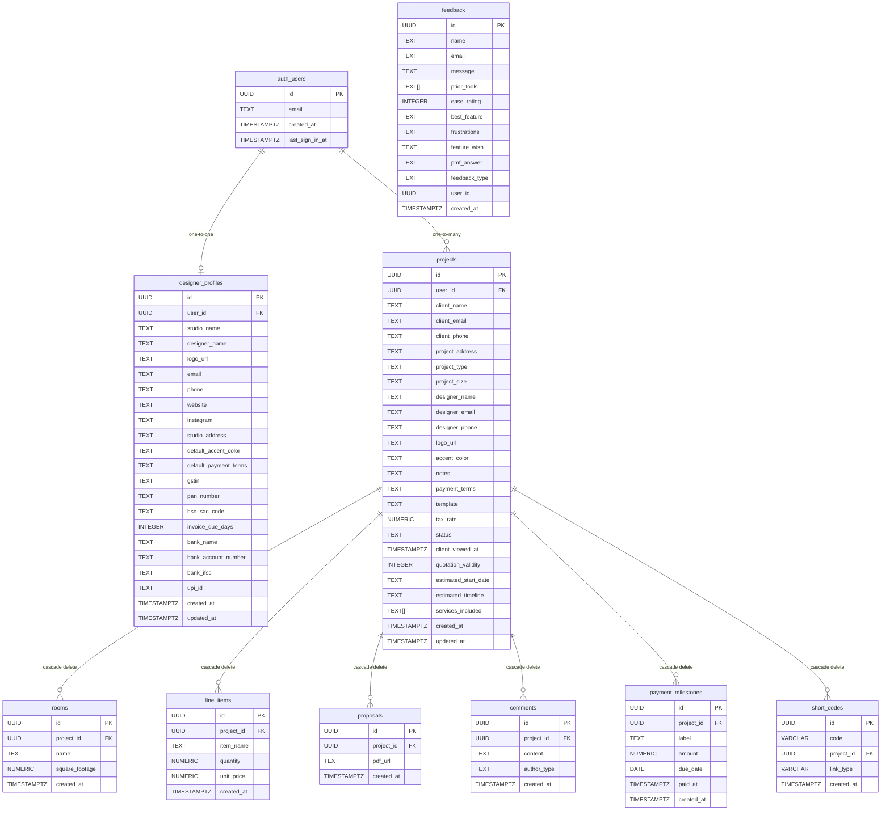

### Project Status Lifecycle

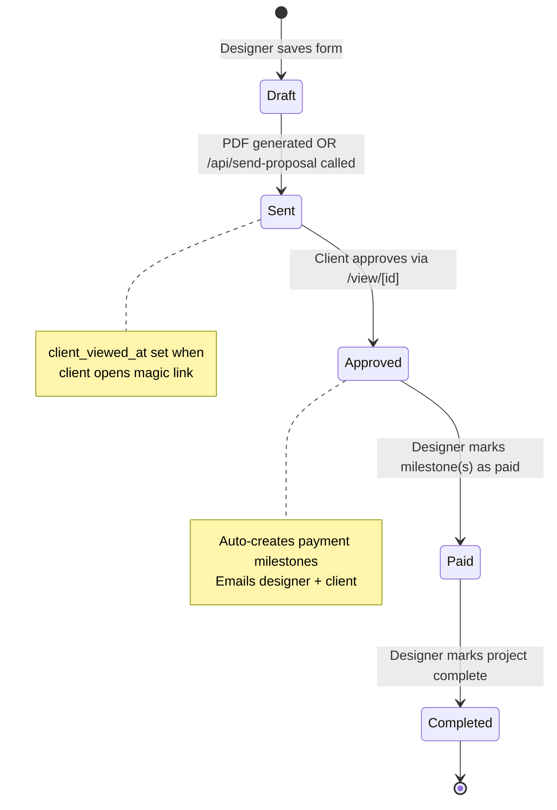

### Indexes

```sql
-- Fast user-scoped project queries (dashboard)
CREATE INDEX idx_projects_user ON projects(user_id);

-- Fast related-data fetching
CREATE INDEX idx_rooms_project ON rooms(project_id);
CREATE INDEX idx_line_items_project ON line_items(project_id);
CREATE INDEX idx_proposals_project ON proposals(project_id);
CREATE INDEX idx_comments_project ON comments(project_id);
CREATE INDEX idx_designer_profiles_user ON designer_profiles(user_id);

-- Fast short code lookup (public-facing)
CREATE UNIQUE INDEX idx_short_codes_code ON short_codes(code);
CREATE INDEX idx_short_codes_project ON short_codes(project_id);
```

### RLS (Row Level Security) Strategy

| Table | Authenticated User | Unauthenticated (Public) |
|-------|-------------------|-------------------------|
| `projects` | CRUD own rows (`user_id = auth.uid()`) | SELECT where status IN ('Sent','Approved','Paid','Completed') |
| `rooms` | CRUD via project ownership | SELECT for shared projects |
| `line_items` | CRUD via project ownership | SELECT for shared projects |
| `proposals` | CRUD via project ownership | SELECT for shared projects |
| `comments` | All (via project ownership) | All (open policy) |
| `payment_milestones` | CRUD via project ownership | SELECT (public) |
| `short_codes` | INSERT own projects | SELECT (public — anyone can resolve) |
| `designer_profiles` | CRUD own profile | SELECT for profiles owning shared projects |
| `feedback` | INSERT + SELECT | INSERT only |

**Service Role bypass:** All API routes use `createServerClient()` with the service role key, which bypasses RLS entirely. This is intentional — it allows server-side operations to cross ownership boundaries (e.g. reading a designer's profile to send them an email when their client approves).

---

## 7. Authentication Flow

### Complete Auth Sequence Diagram

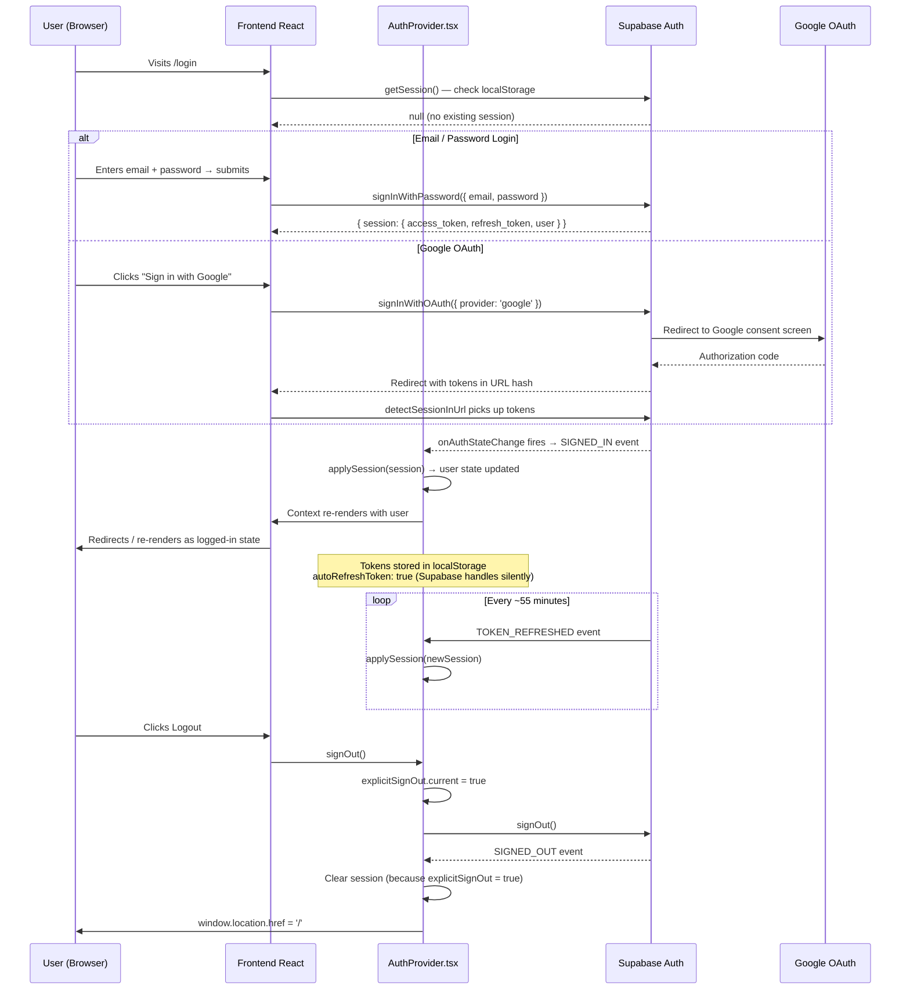

### Session Recovery Logic

`AuthProvider.tsx` implements a **3-tier session recovery mechanism** to prevent users from being kicked out due to transient network failures during token refresh:

```
SIGNED_OUT event fires
       ↓
Is it an explicit sign-out? (explicitSignOut.current = true)
  YES → Clear session immediately
  NO  → This might be a failed token refresh:
         Wait 1500ms grace period
         Try getSession() → if session found, restore it
         Try refreshSession() → if session found, restore it
         If both fail → truly expired, clear session
```

### Authorization Layers

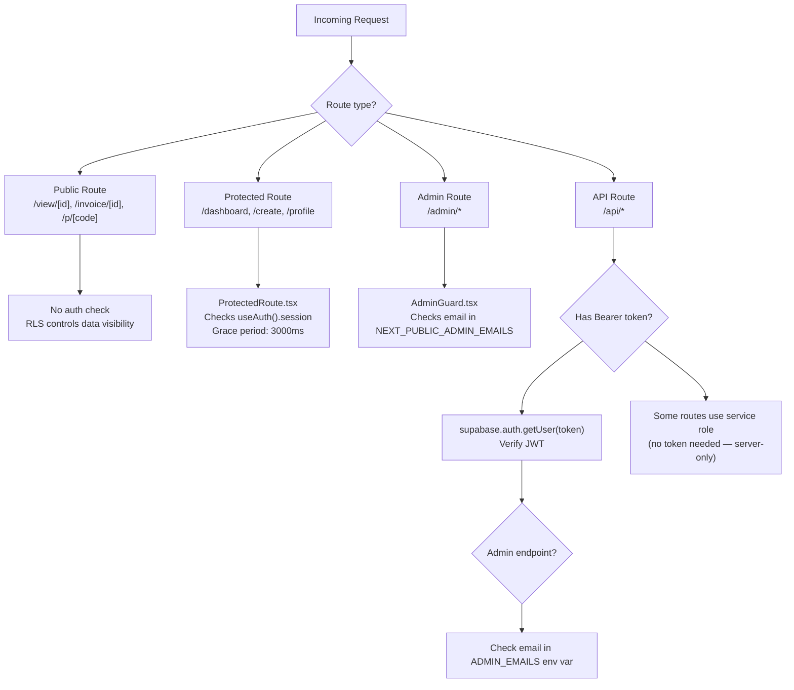

---

## 8. Third-Party Services

### 8.1 Supabase Auth

| Attribute | Detail |
|-----------|--------|
| **Why** | Provides managed JWT authentication with email/password and OAuth — no need to build auth from scratch |
| **Data flow** | User credentials → Supabase Auth → JWT tokens stored in `localStorage` → anon key grants access to user-scoped data via RLS |
| **Failure impact** | **Critical** — if Supabase Auth goes down, users cannot log in. Existing sessions (stored in localStorage) continue working until tokens expire (~1 hour). Auth recovery logic (`AuthProvider.tsx`) handles transient failures |
| **Files** | [`src/lib/supabase.ts`](../../src/lib/supabase.ts), [`src/components/AuthProvider.tsx`](../../src/components/AuthProvider.tsx) |

### 8.2 Supabase PostgreSQL

| Attribute | Detail |
|-----------|--------|
| **Why** | Managed PostgreSQL with real-time, RLS, auto-generated REST API, and Storage — eliminates need for a separate backend server |
| **Data flow** | All application data (projects, rooms, line items, profiles, invoices, comments, milestones) lives here |
| **Failure impact** | **Critical** — if DB is down, the entire application fails. No caching layer exists currently |
| **Files** | [`src/lib/supabase.ts`](../../src/lib/supabase.ts), all API routes, all page components |

### 8.3 Supabase Storage

| Attribute | Detail |
|-----------|--------|
| **Why** | S3-compatible object storage co-located with the DB — stores designer logos and generated PDFs |
| **Data flow** | `logos` bucket: designer uploads logo → URL stored in `designer_profiles.logo_url`. `proposals` bucket: API generates PDF → uploads binary → URL stored in `proposals.pdf_url` |
| **Buckets** | `logos` (public), `proposals` (public) |
| **Failure impact** | **High** — PDF generation fails, logos don't display. Previously stored PDF URLs still work (CDN-served) |
| **Files** | [`src/app/api/generate-pdf/route.ts`](../../src/app/api/generate-pdf/route.ts) |

### 8.4 Browserless.io

| Attribute | Detail |
|-----------|--------|
| **Why** | Headless Chrome as a REST API — converts HTML/CSS to pixel-perfect A4 PDFs without running a browser on the server |
| **Data flow** | Server sends POST with HTML string → Browserless runs Chrome headlessly → returns PDF bytes → server uploads to Supabase Storage |
| **Endpoint** | `POST https://chrome.browserless.io/pdf?token={TOKEN}` |
| **Timeout** | `maxDuration = 30` seconds on the Next.js route |
| **Failure impact** | **High** — PDF generation fails completely. No retry logic or fallback. Designer sees error |
| **Files** | [`src/app/api/generate-pdf/route.ts`](../../src/app/api/generate-pdf/route.ts), [`src/lib/templates.ts`](../../src/lib/templates.ts) |

### 8.5 Resend

| Attribute | Detail |
|-----------|--------|
| **Why** | Transactional email API with a generous free tier — sends proposal notifications, approval alerts, and invoice links |
| **Data flow** | API routes call `resend.emails.send()` with from/to/subject/html. Emails sent from `notifications@kalvora.kaliprlabs.in` |
| **Trigger events** | (1) Designer sends proposal → client email. (2) Client approves → designer email. (3) Client approves → client invoice email. (4) Client requests changes → designer email |
| **Failure impact** | **Medium** — email delivery fails silently (try/catch in all email calls). The underlying DB action (approve, view) still succeeds |
| **Files** | [`src/app/api/send-proposal/route.ts`](../../src/app/api/send-proposal/route.ts), [`src/app/api/respond-proposal/route.ts`](../../src/app/api/respond-proposal/route.ts) |

### 8.6 Google OAuth

| Attribute | Detail |
|-----------|--------|
| **Why** | Reduces signup friction for designers — one click instead of filling out a form |
| **Data flow** | User clicks Google button → Supabase redirects to Google → Google authenticates → redirects back to Supabase with code → Supabase creates/looks up user → JWT issued |
| **Failure impact** | **Low** — email/password auth still works. Google login shows error |
| **Configuration** | Configured in Supabase Auth dashboard (not in application code). `detectSessionInUrl: true` in client config handles the OAuth redirect |

### 8.7 Vercel (Hosting)

| Attribute | Detail |
|-----------|--------|
| **Why** | Zero-config Next.js deployment, global CDN, serverless functions, automatic HTTPS |
| **Data flow** | All static assets served from Vercel's CDN. API routes run as serverless functions (Node.js runtime) |
| **Failure impact** | **Critical** — if Vercel goes down, the entire application is inaccessible |
| **Config** | [`next.config.mjs`](../../next.config.mjs) — minimal: `reactStrictMode: false` |

---

## 9. Infrastructure & Deployment

### Current Infrastructure

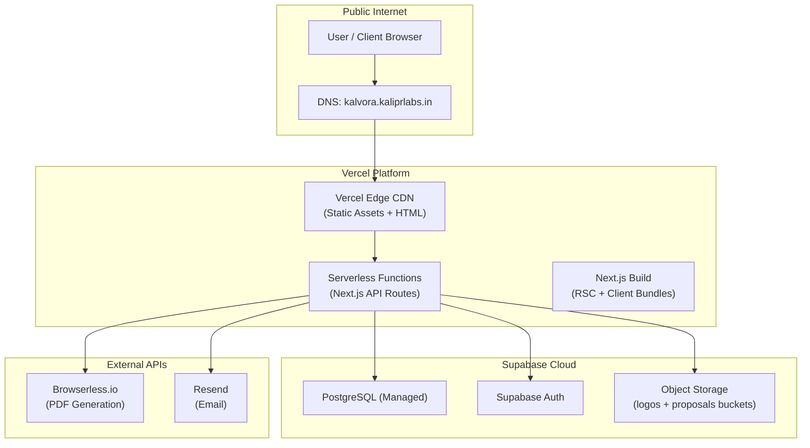

### Environment Variables

| Variable | Scope | Used By | Secret? |
|---------|-------|---------|---------|
| `NEXT_PUBLIC_SUPABASE_URL` | Client + Server | Supabase JS client | No |
| `NEXT_PUBLIC_SUPABASE_ANON_KEY` | Client + Server | Supabase browser client | No (public RLS-limited key) |
| `SUPABASE_SERVICE_ROLE_KEY` | Server only | API routes — bypasses RLS | **YES — never expose** |
| `BROWSERLESS_API_TOKEN` | Server only | `/api/generate-pdf` | **YES** |
| `RESEND_API_KEY` | Server only | Email API routes | **YES** |
| `NEXT_PUBLIC_APP_URL` | Client + Server | Email links, short URL base | No |
| `ADMIN_EMAILS` | Server only | Admin API route verification | No |
| `NEXT_PUBLIC_ADMIN_EMAILS` | Client | AdminGuard.tsx | No |

### Build & Deployment

```bash
# Development
npm run dev          # next dev — local server at localhost:3000

# Production build
npm run build        # next build — TypeScript compile + RSC bundling
npm run start        # next start — production server

# Linting
npm run lint         # next lint — ESLint
```

**Deployment flow (inferred — Vercel Git integration):**
1. Code pushed to GitHub (`pratikanpat/Kalvora`)
2. Vercel detects push → triggers build (`next build`)
3. Static pages and API routes deployed to Vercel's global network
4. Supabase migrations applied manually via Supabase SQL Editor (no automated migration runner)

---

## 10. Scalability Analysis

### Current Scale (v12.0.0)

Based on the README and metadata: **~100+ interior designers** actively using the platform.

### Scalability Concepts Evaluated

#### DNS
- **Currently using?** Yes — `kalvora.kaliprlabs.in` resolves to Vercel's load balancers
- **How?** Vercel manages DNS routing to its edge network automatically
- **When to revisit?** Only if moving away from Vercel to a custom hosting setup

#### CDN
- **Currently using?** Yes — Vercel's CDN serves static assets (JS bundles, CSS, fonts, public images)
- **How?** All Next.js static output is automatically distributed to Vercel's edge nodes
- **Gap?** Supabase Storage PDFs and logos are served directly from Supabase's CDN — not cached on Vercel

#### Load Balancer
- **Currently using?** Yes — implicitly via Vercel (manages routing across serverless function instances)
- **How?** Vercel's infrastructure auto-scales API routes as serverless functions
- **Gap?** No fine-grained control over load balancing strategy

#### Horizontal Scaling
- **Currently using?** Yes — serverless functions scale horizontally by default on Vercel
- **Gap?** The Supabase `serverClient` singleton is cached per process — in serverless this means one connection per cold-started instance, not truly reused. At high throughput this is fine; at extreme scale it could cause connection pool exhaustion

#### Vertical Scaling
- **Currently using?** Partially — Supabase's managed PostgreSQL can be scaled up (compute tier) through their dashboard
- **When needed?** At ~1,000 concurrent active users, the DB might need a compute upgrade

#### API Gateway
- **Currently using?** No explicit API gateway — Vercel acts as a primitive gateway routing to Next.js serverless functions
- **When needed?** At 10,000+ users, a dedicated API gateway (AWS API Gateway, Kong) would add rate limiting, request validation, and observability

#### Queues / Message Brokers
- **Currently using?** ❌ No
- **Current bottleneck?** PDF generation and email sending happen **synchronously within the API route**. If Browserless.io is slow, the entire request blocks for up to 30 seconds
- **When needed?** At 1,000+ concurrent proposals, these should be moved to an async queue (e.g., Upstash QStash, AWS SQS). Workflow: API receives request → enqueues job → returns `{ jobId }` → client polls for completion
- **How to implement?** Add Upstash QStash: `POST /api/generate-pdf` → enqueues → worker function generates PDF → updates DB → client polls `/api/pdf-status?jobId=xxx`

#### Pub/Sub
- **Currently using?** ❌ No
- **When needed?** For real-time client notifications (e.g., "your client just viewed the proposal"), Supabase Realtime (built-in pub/sub) could be used. Currently there's no real-time feature — designers refresh manually

#### Caching
- **Currently using?** ❌ No application-level caching. Supabase has internal PostgreSQL caching
- **Current impact?** Analytics endpoint (`/api/analytics`) recomputes stats from raw data on every request
- **When needed?** At 5,000+ users, add Redis/Upstash to cache analytics results (TTL 5 minutes), frequently accessed profiles, and short code lookups
- **Short code lookup** is currently a DB hit on every public proposal/invoice view — an ideal cache candidate (codes are immutable once created)

#### Read Replicas
- **Currently using?** ❌ No — single Supabase instance
- **When needed?** At 10,000+ users, add a read replica for analytics queries and the admin dashboard so heavy reads don't compete with write operations

#### Rate Limiting
- **Currently using?** ❌ No application-level rate limiting
- **Vulnerability?** `/api/generate-pdf` is expensive (hits Browserless, uploads to Storage) and has no rate limiting — a malicious actor could spam it. `/api/respond-proposal` has no rate limiting — a client could repeatedly "approve" or spam comments
- **When needed?** Immediately at any meaningful scale — add Upstash Ratelimit (Redis-based) or Vercel's middleware-based rate limiting

#### Kubernetes / Containers
- **Currently using?** ❌ No — fully serverless
- **When needed?** At 100,000+ users or if moving off Vercel (e.g., for cost or customization). At that point, containerizing the Next.js app and deploying to Kubernetes (GKE/EKS) with horizontal pod autoscaling would be appropriate

---

## 11. Performance Bottlenecks

### Current Bottlenecks

#### 1. PDF Generation (Most Critical)
- **Path:** Designer clicks "Generate" → `/api/generate-pdf`
- **Bottleneck:** Synchronous call to Browserless.io (external HTTP request) can take 5–20 seconds
- **Impact:** 30-second `maxDuration` limit on the API route. If Browserless is slow, users stare at a spinner
- **Recommendation:** Move to async queue. Return a job ID immediately; poll for result

#### 2. Analytics Computation on Every Load
- **Path:** Dashboard loads → `GET /api/analytics`
- **Bottleneck:** Fetches all projects, then all line items for approved projects, then computes totals in JavaScript — O(n) with n being the designer's proposal count
- **Current impact:** Low (most designers have <50 proposals). Future impact: grows linearly
- **Recommendation:** Cache result per user (Redis, TTL 5 min). Or use PostgreSQL aggregate functions in the query

#### 3. N+1 Query Potential on Admin Routes
- **Path:** `GET /api/admin/stats`
- **Bottleneck:** `supabase.auth.admin.listUsers({ perPage: 1000 })` is called **twice** (once for all users, once for recent users — but they fetch the same data and filter in JS). The `admin/users` route cross-joins users + profiles + projects in JavaScript rather than using SQL JOINs
- **Recommendation:** Single `listUsers` call with client-side filtering. Use a materialized view or a single SQL JOIN for the enriched user list

#### 4. No Connection Pooling
- **Path:** All API routes → `createServerClient()` → Supabase
- **Bottleneck:** Supabase's default PostgreSQL connection limit. In serverless, each cold-started function creates a new connection
- **Recommendation:** Use PgBouncer (available via Supabase's connection pooling URL) or Supabase's `@supabase/supabase-js` connection pool settings

#### 5. Short Code Resolution on Public Pages
- **Path:** Client visits `/p/KV-xxxxx` → `resolveShortCode()` → DB query → redirect
- **Bottleneck:** Every proposal/invoice view hits the DB for what is essentially a static mapping (codes don't change)
- **Recommendation:** Cache resolved codes in-memory (service worker / edge cache) or use Vercel Edge Config for O(1) lookup

### Potential Future Bottlenecks

| Bottleneck | Trigger Scale | Mitigation |
|-----------|--------------|-----------|
| Supabase free tier limits | ~500 users | Upgrade Supabase plan or implement caching |
| DB connection pool exhaustion | ~2,000 req/min | PgBouncer connection pooling |
| Browserless rate limits | ~100 PDFs/day (free tier) | Upgrade Browserless plan or run self-hosted Chromium |
| Resend email limits | ~100 emails/day (free tier) | Upgrade Resend plan |
| Storage costs | ~1,000+ PDFs | Implement PDF retention policy / cleanup old versions |

---

## 12. Production Readiness Assessment

| Category | Score | Notes |
|----------|-------|-------|
| **Security** | 6/10 | RLS enforced on all tables ✅. Service role key kept server-side ✅. Input validation implemented ✅. **No rate limiting** ❌. Admin auth is email-allowlist (brittle) ❌. No CSP headers ❌ |
| **Scalability** | 5/10 | Serverless scales horizontally ✅. No caching layer ❌. No async queue for PDF/email ❌. Single DB instance ❌. No connection pooling ❌ |
| **Reliability** | 6/10 | Session recovery logic in AuthProvider ✅. Email failures are non-blocking ✅. Milestone creation failures are non-blocking ✅. No retry logic for Browserless ❌. No circuit breaker ❌ |
| **Fault Tolerance** | 4/10 | Email failures don't block approval ✅. Milestone creation failures don't block approval ✅. No fallback for PDF generation ❌. No fallback DB ❌. No health checks ❌ |
| **Maintainability** | 8/10 | Well-structured folder layout ✅. TypeScript throughout ✅. Centralized validators ✅. Centralized Supabase client ✅. `project_summary.md` as living context doc ✅. Manual DB migrations ❌ |
| **Observability** | 3/10 | `console.error` logging in API routes ✅. No structured logging ❌. No error monitoring (Sentry) ❌. No performance tracing ❌. No uptime monitoring ❌ |

### Top 5 Production Improvements (Priority Order)

1. **Add Sentry** — Error monitoring and performance tracing across all API routes
2. **Add rate limiting** — Protect `/api/generate-pdf`, `/api/respond-proposal`, and all public endpoints
3. **Move PDF generation to async queue** — Prevent 30-second blocking requests; improve UX
4. **Add Redis caching** — Cache analytics results, short code lookups, and designer profiles
5. **Add Supabase migration tool** (e.g., `supabase CLI`) — Automate DB migrations instead of manual SQL editor runs

---

## 13. Learning Section: Kalvora → System Design Concepts

This section maps every feature in Kalvora to the underlying system design concept it implements. This is a practical guide for beginners connecting theory to real code.

### Concept Mapping Table

| Kalvora Feature | System Design Concept | How It's Implemented |
|----------------|----------------------|---------------------|
| Login with email/password | **Authentication** | Supabase Auth issues JWT; stored in localStorage |
| Login with Google | **OAuth 2.0 / SSO** | Supabase + Google OAuth provider; `detectSessionInUrl` |
| Dashboard only shows your proposals | **Authorization + Multi-tenancy** | Supabase RLS: `WHERE user_id = auth.uid()` |
| Client views proposal without login | **Public-facing API with RLS** | Status-based RLS policy allows public SELECT |
| Session survives page refresh | **Stateless Auth + Token Persistence** | JWT in localStorage, auto-refreshed by Supabase SDK |
| `KV-R7x3mQ` instead of raw UUIDs | **URL Shortening Service** | Short code table with unique index; client-side redirect |
| PDF generated server-side | **Serverless Functions** | Next.js API route on Vercel's Node runtime |
| Browserless.io generates PDFs | **External API Integration** | REST API call (POST) to a third-party headless browser service |
| PDF stored in Supabase Storage | **Object Storage** | Binary files stored separately from DB; served via CDN URL |
| Supabase service role key server-only | **Secret Management** | Env var without `NEXT_PUBLIC_` prefix — never in browser bundle |
| Emails sent via Resend | **Transactional Email / Event-Driven Notification** | API call triggered by approval event |
| Auto-payment milestones on approval | **Business Logic as a Service** | Server-side computation triggered by a state transition |
| `ADMIN_EMAILS` environment variable | **Role-Based Access Control (RBAC)** | Email allowlist checked in both client guard and server route |
| Analytics recomputed per request | **Real-time Aggregation** | Full table scan + JS computation (naive) — candidate for caching |
| `client_viewed_at` timestamp | **Event Tracking / Analytics** | Immutable timestamped event written on first link open |
| All tables have `CASCADE DELETE` | **Data Integrity / Referential Integrity** | FK constraints ensure no orphaned rows when a project is deleted |
| `onAuthStateChange` listener | **Event-Driven Architecture** | Supabase fires events; AuthProvider reacts asynchronously |
| Token refresh recovery with grace period | **Resilience Engineering** | Timeout + retry pattern to handle transient auth failures |
| Comments + approval thread | **Collaborative Workflow** | Persistent discussion state tied to a resource (project) |

### Feature → Deep Dive Examples

#### Dashboard Load
```
User visits /dashboard
    → ProtectedRoute checks JWT               (Authorization)
    → useEffect fetches GET /api/analytics    (API call)
    → supabase.from('projects').select(...)   (DB Read — full table scan filtered by user_id)
    → INDEX idx_projects_user used             (Database Indexing)
    → Response rendered as React components   (UI rendering)
```

#### Share Proposal with Client
```
Designer clicks "Copy Short Link"
    → getOrCreateShortCode(projectId, 'view')  (URL Shortener)
    → Check short_codes WHERE project_id = ?   (DB Read)
    → If none: generateCode() → INSERT          (DB Write with retry on unique violation)
    → Build URL: /p/KV-xxxxx                   (Short URL)

Client opens /p/KV-xxxxx
    → resolveShortCode(code)                   (URL Resolution)
    → SELECT project_id FROM short_codes       (Indexed lookup O(1))
    → router.replace('/view/{projectId}')      (HTTP Redirect)
    → /view page loads with public RLS         (Authorization without authentication)
```

#### Invoice Generation (Auto-triggered on Approval)
```
Client approves proposal
    → POST /api/respond-proposal { action: 'approve' }
    → UPDATE projects SET status='Approved'           (State Machine transition)
    → SELECT line_items → compute grand total          (Aggregation)
    → INSERT payment_milestones [30%, 40%, 30%]       (Auto-provisioning)
    → Resend email to designer                         (Event notification)
    → Resend email to client with /i/KV-xxxxx         (Event notification + URL shortener)
    → Client clicks invoice link → /i/[code] resolves
    → GET /api/invoice-data bypasses RLS              (Service role for public page)
    → Invoice rendered with GST breakdown             (Business logic: CGST + SGST split)
```

---

## 14. Future Architecture by Scale

### 1,000 Users — "The Startup Phase"

**Changes needed:** Minimal. The current architecture handles this comfortably.

**Add:**
- Sentry for error monitoring
- Rate limiting on PDF and proposal endpoints
- Upgrade Supabase plan if free tier limits are hit
- Move to Supabase's connection pooler (Transaction mode via PgBouncer URL)

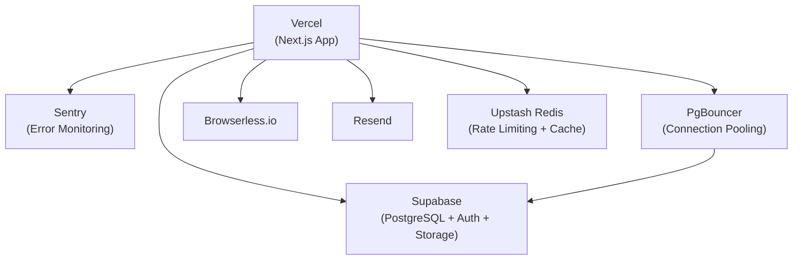

---

### 10,000 Users — "Product-Market Fit"

**Changes needed:** Significant. Async queues, caching, and observability become mandatory.

**Add:**
- **Async PDF queue** — Upstash QStash or AWS SQS for PDF generation jobs
- **Redis caching** — Analytics results, short codes, designer profiles
- **Read replica** — Supabase read replica for analytics and admin queries
- **Monitoring** — Datadog or similar for APM, dashboards, alerts
- **CDN for PDFs** — Route Supabase Storage through Cloudflare for global PDF delivery

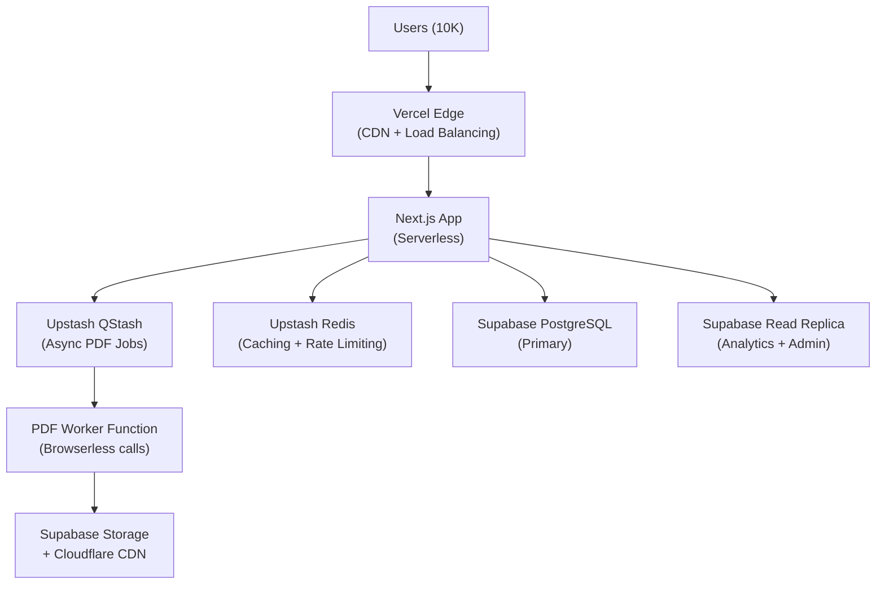

---

### 100,000 Users — "Scale-Up Phase"

**Changes needed:** Major architectural overhaul.

**Add:**
- **Microservices split** — Separate PDF Service, Email Service, Analytics Service as independent deployments
- **Event streaming** — Kafka or AWS Kinesis for audit trails and decoupled service communication
- **Database sharding** — Shard projects by `user_id` hash if write throughput demands it
- **Multi-region deployment** — Deploy to India-specific infrastructure (AWS ap-south-1 / GCP asia-south1) for latency
- **Dedicated search** — Elasticsearch or Typesense for designer proposal search across large datasets
- **Billing service** — Stripe integration for subscription management (alluded to in roadmap)

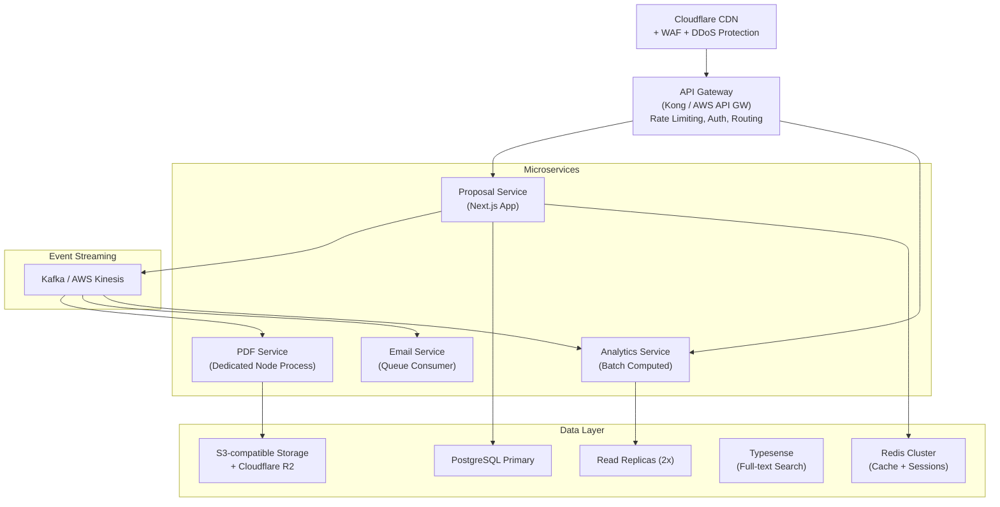

---

### 1,000,000 Users — "Hyperscale"

At this scale, Kalvora would need to be fundamentally re-architected from a monolithic Next.js app into a distributed system:

**Key changes:**
- **Global multi-region active-active** — Deploy to 3+ regions (US, EU, India) with data sovereignty compliance
- **CQRS (Command Query Responsibility Segregation)** — Separate write path (proposals, approvals) from read path (dashboard, invoice views)
- **Event sourcing** — Store state changes as events for auditability and replay
- **Kubernetes** — Replace serverless with containerized services in Kubernetes for predictable latency and resource control
- **Dedicated CDN** — All assets, PDFs, and short link resolution at the edge (Cloudflare Workers for sub-1ms redirects)
- **Multi-tenant DB architecture** — Separate database schemas or clusters per enterprise customer if B2B tier exists
- **Dedicated billing** — Full Stripe integration with subscription management, usage metering, and invoicing

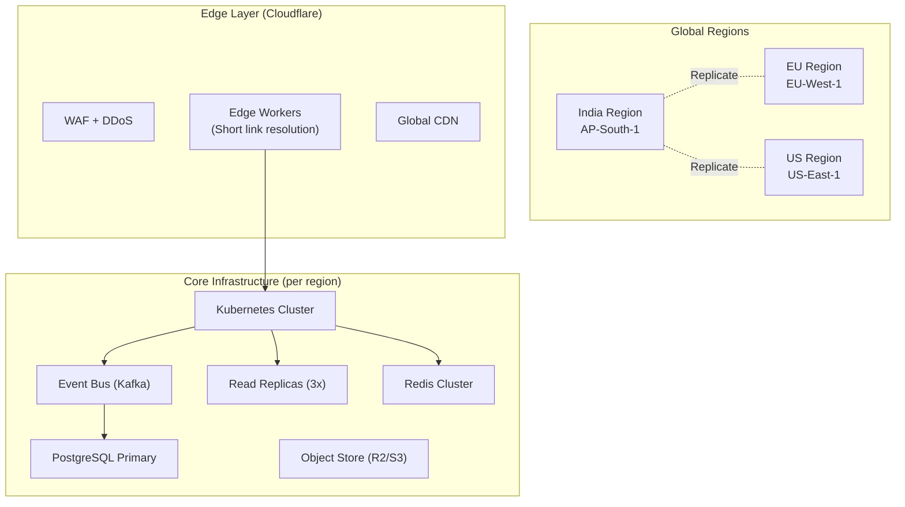

---

*Document authored by the Antigravity engineering assistant · Based on complete codebase analysis · Repository: `pratikanpat/Kalvora`*
