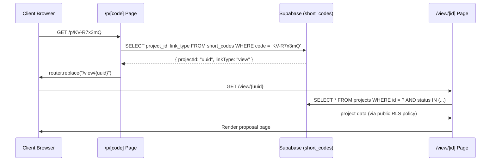

# Kalvora — Request Flow Reference

> Part of the Kalvora System Design docs · See also: [kalvora-system-design.md](./kalvora-system-design.md)

This document traces every significant user-initiated action from the first click through to the database response and back to the UI. Use it to understand data flow before modifying any feature.

---

## Flow Index

1. [User Registration](#1-user-registration)
2. [User Login (Email/Password)](#2-user-login-emailpassword)
3. [Google OAuth Login](#3-google-oauth-login)
4. [Forgot Password / Reset](#4-forgot-password--reset)
5. [Create a Proposal (Full Flow)](#5-create-a-proposal-full-flow)
6. [Generate a PDF](#6-generate-a-pdf)
7. [Send Proposal to Client](#7-send-proposal-to-client)
8. [Client Views Proposal (Magic Link)](#8-client-views-proposal-magic-link)
9. [Client Approves Proposal](#9-client-approves-proposal)
10. [Client Requests Changes](#10-client-requests-changes)
11. [Designer Views Invoice Page](#11-designer-views-invoice-page)
12. [Dashboard Load & Analytics](#12-dashboard-load--analytics)
13. [Short Link Resolution](#13-short-link-resolution)
14. [Admin Dashboard Load](#14-admin-dashboard-load)
15. [Logout Flow (with Feedback)](#15-logout-flow-with-feedback)

---

## 1. User Registration

```
User visits /signup
    ↓
Enters: name, email, password
    ↓
[Client] validateEmail(email) → inline error if invalid
    ↓
[Client] supabase.auth.signUp({ email, password })
    ↓
[Supabase Auth] Creates user in auth.users table
                Sends confirmation email (optional, based on Supabase config)
    ↓
[Client] AuthProvider.onAuthStateChange → SIGNED_IN event fires
    ↓
[Client] AuthProvider.applySession(session) → user state set
    ↓
[Client] Router pushes to /dashboard (or / → LoggedInHome if no profile)
    ↓
[Client] ProfileSetupModal shown if no designer_profiles row exists
          → Designer fills studio name, logo, email, phone
          → supabase.from('designer_profiles').insert(...)
```

**Files involved:**
- `src/app/signup/page.tsx`
- `src/components/AuthProvider.tsx`
- `src/components/ProfileSetupModal.tsx`
- `src/lib/supabase.ts`

---

## 2. User Login (Email/Password)

```
User visits /login
    ↓
AuthProvider.bootstrap() runs
    → supabase.auth.getSession() — check localStorage
    → If session found → apply it (user was already logged in)
    ↓
User enters email + password → clicks "Log In"
    ↓
[Client] validateEmail(email) — inline validation
    ↓
[Client] supabase.auth.signInWithPassword({ email, password })
    ↓
[Supabase Auth] Validates credentials
                Issues: access_token (JWT), refresh_token
    ↓
Tokens stored in localStorage (via Supabase JS SDK)
    ↓
[AuthProvider] onAuthStateChange → SIGNED_IN
    → applySession(session)
    → lastGoodSession.current = session
    ↓
[Client] page.tsx detects `user` in context
         → Renders LoggedInHome (Closing Engine)
```

**Error path:**
```
supabase.auth.signInWithPassword fails
    ↓
error.message returned (e.g. "Invalid login credentials")
    ↓
[Client] setError(error.message)
         toast.error(message)
```

---

## 3. Google OAuth Login

```
User clicks "Continue with Google" on /login or /signup
    ↓
[Client] supabase.auth.signInWithOAuth({
    provider: 'google',
    options: { redirectTo: `${APP_URL}/auth/callback` }
})
    ↓
Browser redirects to: accounts.google.com/oauth/...
    ↓
User authenticates with Google
    ↓
Google redirects back with authorization code
    ↓
Supabase Auth exchanges code for Google tokens
    → Creates or looks up user in auth.users by email
    → Issues Supabase JWT (access_token + refresh_token)
    ↓
Browser redirects to APP_URL with tokens in URL hash fragment
    ↓
[Client] supabase.js detectSessionInUrl: true
         → Reads tokens from URL hash
         → Stores in localStorage
    ↓
[AuthProvider] onAuthStateChange → SIGNED_IN
    → applySession(session)
    ↓
page.tsx renders LoggedInHome
```

---

## 4. Forgot Password / Reset

```
User visits /forgot-password
    ↓
Enters email → clicks "Send Reset Link"
    ↓
[Client] supabase.auth.resetPasswordForEmail(email, {
    redirectTo: `${APP_URL}/reset-password`
})
    ↓
[Supabase Auth] Sends password reset email with magic link
    ↓
User clicks link in email → Browser opens /reset-password?token=...
    ↓
[Client] Reads token from URL
         supabase.auth.updateUser({ password: newPassword })
    ↓
[Supabase Auth] Updates user password in auth.users
    ↓
[Client] Session automatically active (Supabase auto-signs in after reset)
         Router pushes to /dashboard
```

---

## 5. Create a Proposal (Full Flow)

```
User visits /create (ProtectedRoute checks — must be logged in)
    ↓
Page mounts:
    [Client] Fetch designer profile:
        supabase.from('designer_profiles')
                .select('*')
                .eq('user_id', user.id)
                .single()
    → Pre-fills: payment_terms, logo_url, designer_name,
                 accent_color, email, phone

    ↓
User fills 8 sections:
    Section 1: Client Info (name*, email, phone, address)
    Section 2: Project Details (type, size)
    Section 3: Rooms (name, sq.ft — multiple, dynamically added)
    Section 4: Services Included (checkboxes)
    Section 5: Pricing (line items: name, qty, price; live subtotal/tax/total calc)
    Section 6: Timeline (start date, duration)
    Section 7: Notes & Terms (payment terms, validity)
    Section 8: Template (pick from 6, preview modal available)

    ↓
User clicks "Save as Draft":
    [Client] INSERT INTO projects {
        user_id: user.id,
        client_name, client_email, ...all fields...,
        status: 'Draft'
    }
    → project.id returned
    [Client] INSERT INTO rooms[] (for each room, parallel inserts)
    [Client] INSERT INTO line_items[] (for each item, parallel inserts)
    → Router pushes to /proposals/{id}

    ↓
OR User clicks "Generate & Send":
    [Client] Same inserts as Draft
    → Then immediately calls:
    [Client] POST /api/generate-pdf { project_id }
    (See Flow 6 for PDF generation details)
```

**Key validation:**
- Client email: `validateEmail()` before submit
- Client phone: `validatePhone()` before submit
- Client name: required — cannot submit without it

---

## 6. Generate a PDF

```
[Client] POST /api/generate-pdf
    Body: { project_id: "uuid" }
    ↓
[Server API] Receives request
    VALIDATION: project_id present? → 400 if not
    VALIDATION: BROWSERLESS_API_TOKEN set? → 500 if not
    ↓
[Server] createServerClient() — service role (bypasses RLS)
    ↓
[Server] PARALLEL DB queries:
    → SELECT * FROM projects WHERE id = project_id → single
    → SELECT name, square_footage FROM rooms WHERE project_id = ?
    → SELECT item_name, quantity, unit_price FROM line_items WHERE project_id = ?
    ↓
[Server] Build templateData object from project + rooms + line_items
    ↓
[Server] Select HTML template function:
    switch(project.template) {
        'luxury' → luxuryTemplate(data)
        'modern' → modernTemplate(data)
        'blueprint' → blueprintTemplate(data)
        'editorial' → editorialTemplate(data)
        'highcontrast' → highContrastTemplate(data)
        default → minimalTemplate(data)
    }
    → Returns 50KB+ self-contained HTML/CSS string
    ↓
[Server] PARALLEL:
    → POST https://chrome.browserless.io/pdf?token={TOKEN}
        Body: { html: "<full html>", options: { format: 'A4', printBackground: true } }
    → SELECT COUNT(*) FROM proposals WHERE project_id = ? (for numbering)
    ↓
[Browserless] Renders HTML in headless Chromium
              Returns PDF as binary ArrayBuffer
    ↓
[Server] Construct filename:
    sanitize(client_name) + "_proposal_" + count + ".pdf"
    storageFileName = sanitized + "_" + Date.now() + ".pdf"
    ↓
[Server] Upload PDF to Supabase Storage ('proposals' bucket)
    supabase.storage.from('proposals').upload(storageFileName, pdfBytes)
    ↓
[Server] Get public URL:
    supabase.storage.from('proposals').getPublicUrl(storageFileName)
    → pdfUrl = "https://xxx.supabase.co/storage/v1/object/public/proposals/..."
    ↓
[Server] PARALLEL:
    → INSERT INTO proposals { project_id, pdf_url }
    → If project.status === 'Draft':
        UPDATE projects SET status='Sent', updated_at=NOW()
    ↓
[Server] Return: { pdf_url, download_filename }
    ↓
[Client] SuccessModal shown:
    - "Download PDF" button (browser download via pdf_url)
    - "Copy Proposal Link" button (getOrCreateShortCode → /p/KV-xxxxx)
    - "Copy Invoice Link" button (getOrCreateShortCode → /i/KV-xxxxx)
```

**Failure handling:**
```
Browserless returns non-200:
    → NextResponse.json({ error: "PDF generation failed (503)" }, { status: 500 })
    → Client shows error toast

Supabase Storage upload fails:
    → NextResponse.json({ error: "Failed to upload PDF" }, { status: 500 })
```

---

## 7. Send Proposal to Client

```
Designer on /proposals/{id} clicks "Email to Client"
    ↓
[Client] Checks: client email present in project? → if not, prompt designer
    ↓
[Client] POST /api/send-proposal
    Body: { projectId, clientEmail }
    ↓
[Server] createServerClient()
    ↓
[Server] SELECT client_name, project_type, designer_name, status
         FROM projects WHERE id = projectId
    ↓
[Server] If status === 'Draft':
    UPDATE projects SET status='Sent'
    ↓
[Server] getOrCreateShortCodeServer(projectId, 'view')
    → Check short_codes for existing code
    → If none: INSERT new KV-xxxxx code
    → Returns code
    ↓
[Server] buildShortUrl(APP_URL, code, 'view', projectId)
    → "https://kalvora.kaliprlabs.in/p/KV-R7x3mQ"
    ↓
[Server] Resend.emails.send({
    from: 'Kalvora <notifications@kalvora.kaliprlabs.in>',
    to: clientEmail,
    subject: "📋 New Proposal from {designer_name}",
    html: branded email with "View Proposal →" button
})
    ↓
[Client] Success toast: "Proposal sent to {clientEmail}"
```

---

## 8. Client Views Proposal (Magic Link)

```
Client opens email → clicks "View Proposal →"
    → URL: kalvora.kaliprlabs.in/p/KV-R7x3mQ
    ↓
Browser loads /p/[code] → ShortProposalRedirect component
    ↓
[Client] resolveShortCode("KV-R7x3mQ")
    → supabase.from('short_codes')
              .select('project_id, link_type')
              .eq('code', 'KV-R7x3mQ')
              .single()
    → Returns: { projectId: "uuid", linkType: "view" }
    ↓
[Client] router.replace('/view/{projectId}')
    ↓
Browser loads /view/{projectId}
    ↓
Page mounts (NO auth required):
    [Client] PARALLEL:
        → SELECT * FROM projects WHERE id = ? AND status IN ('Sent','Approved','Paid','Completed')
        → SELECT rooms, sq_footage WHERE project_id = ?
        → SELECT line_items WHERE project_id = ?
        → SELECT pdf_url FROM proposals WHERE project_id = ? ORDER BY created_at DESC
        → SELECT * FROM payment_milestones WHERE project_id = ?
        → SELECT * FROM comments WHERE project_id = ? ORDER BY created_at ASC
    ↓
[Client] POST /api/respond-proposal { projectId, action: 'viewed' }
    → [Server] UPDATE projects SET client_viewed_at = NOW()
    ↓
Proposal rendered:
    - Full proposal content (client info, rooms, line items, totals, terms)
    - Comment history (sorted oldest first)
    - Sticky "Approve Proposal" button
    - "Request Changes" button + comment textarea
```

---

## 9. Client Approves Proposal

```
Client clicks "Approve Proposal" → Confirmation modal opens
    ↓
Client clicks "Yes, Approve & Get Invoice"
    ↓
[Client] POST /api/respond-proposal {
    projectId,
    action: 'approve',
    clientName: "Rahul Kumar",
    projectName: "Residential 3BHK"
}
    ↓
[Server] createServerClient()
    ↓
[Server] SELECT status, user_id, client_email, client_name
         FROM projects WHERE id = projectId
    ↓
[Server] Look up designer email (two sources, fallback order):
    1. supabase.auth.admin.getUserById(project.user_id)
       → designerEmail = user.email (login email)
    2. SELECT email FROM designer_profiles WHERE user_id = ?
       → profileEmail (profile contact email, fallback)
    → targetEmail = designerEmail || profileEmail
    ↓
[Server] UPDATE projects SET status='Approved', updated_at=NOW()
    ↓
[Server] Check if payment milestones exist:
    SELECT id FROM payment_milestones WHERE project_id = ? LIMIT 1
    ↓
    IF none exist:
        SELECT quantity, unit_price FROM line_items WHERE project_id = ?
        → subtotal = sum(qty * price)
        SELECT tax_rate FROM projects WHERE id = ?
        → grandTotal = subtotal + (subtotal * taxRate / 100)
        INSERT payment_milestones [
            { label: 'Advance', amount: grandTotal * 0.30 },
            { label: 'Mid-project', amount: grandTotal * 0.40 },
            { label: 'Final', amount: grandTotal * 0.30 }
        ]
    ↓
[Server] PARALLEL emails via Resend:
    → To designer (targetEmail):
        "🎉 Proposal Approved by {clientName}"
        "View in Dashboard →" button → /proposals/{projectId}
    → To client (project.client_email):
        getOrCreateShortCodeServer(projectId, 'invoice') → KV-xxxxxx
        buildShortUrl → /i/KV-xxxxxx
        "📄 Your Invoice for {projectName}"
        "View Invoice →" button → /i/KV-xxxxxx
    ↓
[Server] Return: { success: true, message: 'Proposal approved' }
    ↓
[Client] Shows redirect overlay: "Preparing Your Invoice..."
[Client] router.push('/invoice/{projectId}')
```

**Non-blocking failures:**
- Milestone creation failure → logged, approval still succeeds
- Email delivery failure → caught in try/catch, approval still succeeds

---

## 10. Client Requests Changes

```
Client types in comment textarea → clicks "Request Changes"
    ↓
[Client] POST /api/respond-proposal {
    projectId,
    action: 'request_changes',
    comment: "Please update the kitchen tiles to Italian marble",
    clientName, projectName
}
    ↓
[Server] createServerClient()
    ↓
[Server] Fetch project + look up designer email (same as approve flow)
    ↓
[Server] INSERT INTO comments {
    project_id: projectId,
    content: comment,
    author_type: 'Client'
}
    ↓
NOTE: Project status does NOT change (stays 'Sent')
    ↓
[Server] Resend email to designer:
    "📝 {clientName} requested changes"
    Shows comment text in bordered box
    "View in Dashboard →" button → /proposals/{projectId}
    ↓
[Client] Comment appears in Discussion section
         Toast: "Changes requested successfully"
```

---

## 11. Designer Views Invoice Page

```
Designer on /proposals/{id} clicks "View Invoice" (only shown if status ≥ Approved)
    ↓
Browser loads /invoice/{id}
    ↓
Page mounts (NO auth required):
    [Client] GET /api/invoice-data?projectId={id}
    ↓
[Server] createServerClient() — service role bypasses all RLS
    ↓
[Server] SELECT * FROM projects
         WHERE id = ? AND status IN ('Sent','Approved','Paid','Completed')
         → 404 if Draft or not found
    ↓
[Server] PARALLEL:
    → SELECT * FROM rooms WHERE project_id = ?
    → SELECT * FROM line_items WHERE project_id = ?
    → SELECT * FROM payment_milestones WHERE project_id = ? ORDER BY created_at
    ↓
[Server] SELECT studio_name, studio_address, email, phone, gstin, pan_number,
                hsn_sac_code, invoice_due_days, bank_name, bank_account_number,
                bank_ifsc, upi_id
         FROM designer_profiles WHERE user_id = project.user_id
    ↓
[Server] Return: { project, milestones, designerProfile }
    ↓
[Client] Renders invoice:
    - Invoice #: formatted from project creation timestamp
    - Invoice Date + Due Date (created_at + invoice_due_days)
    - From: studio_name, address, GSTIN
    - Bill To: client_name, email, phone, project_address
    - Line Items table with HSN/SAC column
    - Subtotal → CGST (half of tax_rate) + SGST (half of tax_rate) → Grand Total
    - Payment Details: bank_name, account_number, IFSC, UPI
    - Payment Schedule: milestones table (read-only)
    - "Print / Save as PDF" → window.print()
```

---

## 12. Dashboard Load & Analytics

```
User navigates to /dashboard (ProtectedRoute checked)
    ↓
Page mounts:
    PARALLEL:
    1. Fetch projects:
        supabase.from('projects')
                .select('id, client_name, project_type, status, created_at,
                         client_viewed_at, updated_at')
                .eq('user_id', user.id)
                .order('created_at', { ascending: false })

    2. Fetch analytics:
        GET /api/analytics
        Headers: { Authorization: `Bearer ${session.access_token}` }
        ↓
        [Server] Verify JWT → get user
        [Server] SELECT id, status FROM projects WHERE user_id = user.id
        [Server] Compute:
            totalProposals = count(all)
            activeProjects = count(status not in ['Draft','Completed'])
            sentOrBeyond = count(status in ['Sent','Approved','Paid','Completed'])
            approved = count(status in ['Approved','Paid','Completed'])
            approvalRate = round(approved / sentOrBeyond * 100)
        [Server] For approved projects: SELECT line_items → compute avg deal size with tax
        [Server] Return: { totalProposals, approvalRate, avgDealSize, activeProjects }
    ↓
[Client] Renders:
    - 4-stat analytics strip (totalProposals, approvalRate, avgDealSize, activeProjects)
    - Action prompt cards (if any proposals are Sent/Approved)
    - Searchable, filterable project list
    - Follow-up nudges for stale Sent proposals (3+ days old, no client_viewed_at)
```

---

## 13. Short Link Resolution



**Not-found path:**
```
resolveShortCode returns null
    ↓
[Client] setError(true)
         Render: "Link Not Found — This proposal link is invalid or has expired."
```

---

## 14. Admin Dashboard Load

```
Admin visits /admin (AdminGuard checks email against NEXT_PUBLIC_ADMIN_EMAILS)
    ↓
AdminGuard authorized → renders admin layout + page content
    ↓
[Client] GET /api/admin/stats
    Headers: { Authorization: `Bearer ${session.access_token}` }
    ↓
[Server] verifyAdmin():
    → supabase.auth.getUser(token)
    → Check email against ADMIN_EMAILS env var
    → Return 403 if not admin
    ↓
[Server] PARALLEL queries (all using service role — sees all users' data):
    → supabase.auth.admin.listUsers({ perPage: 1000 })
       → allUsers
    → SELECT id, status, created_at FROM projects
       → allProjects
    → SELECT id, feedback_type, created_at FROM feedback
       → allFeedback
    → SELECT id, created_at FROM projects WHERE created_at >= weekAgo
       → recentProjects
    ↓
[Server] Compute metrics in JavaScript:
    totalUsers = allUsers.length
    totalProjects = allProjects.length
    signupsThisWeek = filter(allUsers, created_at >= weekAgo).length
    proposalsThisWeek = recentProjects.length
    projectsByStatus = group allProjects by status
    feedbackByType = group allFeedback by feedback_type
    ↓
[Client] Render metric cards + bar charts + breakdown tables
```

---

## 15. Logout Flow (with Feedback)

```
Designer clicks "Log out" in Sidebar
    ↓
Sidebar intercepts: opens LogoutFeedbackModal
    (Does NOT immediately call signOut())
    ↓
Modal shows:
    "What almost stopped you from creating a proposal today?"
    ↓
OPTION A: "Skip & Log out" (no comment entered):
    Modal calls signOut() directly
    ↓
OPTION B: "Submit & Log out":
    [Client] supabase.from('feedback').insert({
        name: user.email,
        user_id: user.id,
        message: feedbackText,
        feedback_type: 'logout_trigger'
    })
    → If insert fails: silently ignored (never blocks logout)
    ↓
Both options end at:
    [Client] AuthProvider.signOut()
        → explicitSignOut.current = true
        → supabase.auth.signOut()
        → localStorage tokens cleared by Supabase SDK
        → [AuthProvider] SIGNED_OUT event → applySession(null) (because explicit)
        → window.location.href = '/'
    ↓
Browser hard-navigates to / (full page reload — clears all React state)
```

---

*Part of Kalvora System Design Docs · [Back to Main Document](./kalvora-system-design.md)*
