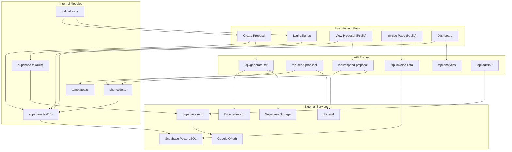

# Kalvora — Services Overview

> Part of the Kalvora System Design docs · See also: [kalvora-system-design.md](./kalvora-system-design.md)

This document provides a complete reference for every internal module (library files, API routes, components) and external service in the Kalvora system. Use it when you need to quickly understand what a specific file does, where it is called from, and what it depends on.

---

## Internal Services & Modules

### `src/lib/supabase.ts` — Database Client Factory

**Purpose:** Creates and exports the two Supabase client instances the application uses.

| Export | Key | Description |
|--------|-----|-------------|
| `supabase` | Browser client | Uses `NEXT_PUBLIC_SUPABASE_ANON_KEY` — subject to Row Level Security. Session-aware: reads/writes `localStorage`. Used by all client-side components. |
| `createServerClient()` | Server client | Uses `SUPABASE_SERVICE_ROLE_KEY` — **bypasses all RLS**. Cached as module-level singleton. Only used in `/api/*` route handlers. |
| `checkSupabaseConfig()` | Helper | Returns `{ configured: boolean }` — used for development feedback when env vars are missing. |

**Critical security rule:** `SUPABASE_SERVICE_ROLE_KEY` is a superuser credential. Never pass it to the browser. Kalvora enforces this by using it only in `createServerClient()`, which is only called from server-side Route Handlers.

**Singleton caching:**
```typescript
let serverClient: SupabaseClient | null = null;

export function createServerClient() {
    if (serverClient) return serverClient;  // Reuse existing instance
    serverClient = createClient(url, serviceRoleKey);
    return serverClient;
}
```
Note: In serverless environments (Vercel), this singleton lasts for the life of a cold-started function — not across requests. Each cold start creates a new DB connection.

---

### `src/lib/shortcode.ts` — URL Shortener Module

**Purpose:** Generates and resolves `KV-xxxxx` short codes for shareable proposal and invoice links.

| Export | Description | Used by |
|--------|-------------|---------|
| `getOrCreateShortCode(projectId, linkType)` | Client-side: checks DB for existing code, inserts new if none. Uses anon key (subject to RLS). | `SuccessModal.tsx`, dashboard pages, `src/app/p/[code]/page.tsx` |
| `getOrCreateShortCodeServer(projectId, linkType)` | Server-side: same logic but uses service role key — bypasses RLS. | `/api/send-proposal`, `/api/respond-proposal` |
| `resolveShortCode(code)` | Looks up a `KV-xxxxx` code → returns `{ projectId, linkType }`. | `/p/[code]/page.tsx`, `/i/[code]/page.tsx` |
| `buildShortUrl(origin, code, linkType, projectId)` | Builds full URL from code. Falls back to UUID URL if code is empty. | All code-generation callsites |

**Code generation algorithm:**
```typescript
function generateCode(): string {
    const chars = 'ABCDEFGHIJKLMNOPQRSTUVWXYZabcdefghijklmnopqrstuvwxyz0123456789';
    let result = '';
    for (let i = 0; i < 6; i++) {
        result += chars.charAt(Math.floor(Math.random() * chars.length));
    }
    return `KV-${result}`;  // e.g. "KV-R7x3mQ"
}
```

**Collision handling:** Up to 5 retry attempts. On `23505` (unique constraint violation from PostgreSQL), retries with a new code.

**Fallback:** If all retries fail, returns `''` — `buildShortUrl` then falls back to the full `/view/{uuid}` URL.

---

### `src/lib/validators.ts` — Input Validation Module

**Purpose:** Centralized validation utilities for all user-supplied input. All validators return `{ valid: boolean, message?: string }` for inline UI error display.

| Validator | Format | Real-world Use |
|-----------|--------|----------------|
| `validateEmail` | Standard email regex | Login, signup, client email, designer email |
| `validatePhone` | Indian 10-digit (6-9 prefix, strips `+91`) | Client phone, designer phone |
| `validateGSTIN` | 15-char: `\d{2}[A-Z]{5}\d{4}[A-Z]{1}[1-9A-Z]Z[0-9A-Z]` | Studio profile GSTIN |
| `validatePAN` | 10-char: `[A-Z]{5}\d{4}[A-Z]` | Studio profile PAN |
| `validateIFSC` | 11-char: `[A-Z]{4}0[A-Z0-9]{6}` | Bank IFSC code |
| `validateBankAccount` | 9–18 digits | Bank account number |
| `validateUpiId` | `word@word` format | UPI payment ID |
| `validateHsnSac` | 4–8 digits | HSN/SAC tax code (default: 9971) |
| `validateNumericRange` | Min/max bound check | Tax rate, invoice due days |

All validators treat empty strings as **valid** (optional fields) — only non-empty values are validated against format rules.

---

### `src/lib/templates.ts` — PDF Template Engine

**Purpose:** 50KB file containing 6 self-contained HTML/CSS template functions. Each function accepts a `TemplateData` object and returns a complete HTML string ready for Chromium rendering.

| Template Key | Function | Visual Style |
|-------------|----------|-------------|
| `minimal` | `minimalTemplate(data)` | Clean white, Inter font, blue accent |
| `luxury` | `luxuryTemplate(data)` | Dark background, gold accents, Playfair Display serif |
| `modern` | `modernTemplate(data)` | Bold indigo header bar, geometric design |
| `blueprint` | `blueprintTemplate(data)` | Navy + grid background, technical drawing aesthetic |
| `editorial` | `editorialTemplate(data)` | Warm ivory, magazine-style whitespace |
| `highcontrast` | `highContrastTemplate(data)` | Dark + indigo, SaaS dashboard inspired |

**TemplateData interface:**
```typescript
interface TemplateData {
    client_name: string;
    client_email: string;
    client_phone: string;
    project_address: string;
    project_type: string;
    designer_name: string;
    designer_email: string;
    designer_phone: string;
    logo_url: string;
    accent_color: string;
    notes: string;
    payment_terms: string;
    tax_rate: number;
    created_at: string;
    rooms: { name: string; square_footage: number }[];
    line_items: { item_name: string; quantity: number; unit_price: number }[];
    studio_name: string;
    project_size: string;
    services_included: string[];
    quotation_validity: number;
    estimated_start_date: string;
    estimated_timeline: string;
}
```

**Template rendering:** Pure string interpolation — no template engine (no Handlebars, no Jinja). Each function does direct `${value}` substitution. This means **no XSS protection** in the PDF output — but since PDFs are generated server-side and only contain designer/client data (not user-supplied HTML), this is acceptable for the current use case.

---

### `src/lib/demoData.ts` — Demo Project Presets

**Purpose:** Contains pre-configured project data for the `/try` (zero-auth demo) page. Provides 6 realistic project templates with budget-proportioned line items.

| Demo Type | Description |
|-----------|-------------|
| 2BHK | Standard 2-bedroom apartment |
| 3BHK | Larger family apartment |
| Villa | Luxury villa interior |
| Office | Commercial office space |
| Kitchen | Kitchen renovation |
| Single Room | Single room redesign |

Used only by `src/app/try/page.tsx` — has no interaction with the database.

---

## API Route Services

### `POST /api/generate-pdf`

**File:** [`src/app/api/generate-pdf/route.ts`](../../src/app/api/generate-pdf/route.ts)

```
Input:  { project_id: string }
Output: { pdf_url: string, download_filename: string }
Auth:   Service role (no token validation — but service role limits data access)
Limit:  maxDuration = 30 seconds
```

**What it does:**
1. Fetches project + rooms + line_items in parallel (service role)
2. Builds `TemplateData` from fetched data
3. Selects template function based on `project.template`
4. POSTs HTML to Browserless REST API → gets PDF bytes
5. Uploads PDF to Supabase Storage `proposals` bucket
6. Inserts record in `proposals` table
7. If project was Draft → updates status to Sent

**External dependencies:** Browserless.io (`BROWSERLESS_API_TOKEN`), Supabase Storage

---

### `POST /api/send-proposal`

**File:** [`src/app/api/send-proposal/route.ts`](../../src/app/api/send-proposal/route.ts)

```
Input:  { projectId: string, clientEmail: string }
Output: { success: true, emailResult }
Auth:   Service role (no token validation)
```

**What it does:**
1. Fetches project details (client name, designer name, status)
2. Updates status to `Sent` if currently `Draft`
3. Generates or retrieves short code (`KV-xxxxx`) for the proposal
4. Sends branded email via Resend with short proposal link

**External dependencies:** Resend (`RESEND_API_KEY`), Supabase

---

### `POST /api/respond-proposal`

**File:** [`src/app/api/respond-proposal/route.ts`](../../src/app/api/respond-proposal/route.ts)

```
Input:  { projectId, action: 'viewed'|'approve'|'request_changes', comment?, clientName?, projectName? }
Output: { success: true, message: string }
Auth:   Service role (no token validation — called from public /view page)
```

**What it does (by action):**

| Action | DB Changes | Emails Sent |
|--------|-----------|-------------|
| `viewed` | `UPDATE projects SET client_viewed_at = NOW()` | None |
| `approve` | `UPDATE projects SET status='Approved'`; `INSERT payment_milestones` (if none exist) | Designer: approval notification; Client: invoice link |
| `request_changes` | `INSERT comments { author_type: 'Client' }` | Designer: change request with comment text |

**External dependencies:** Resend (`RESEND_API_KEY`), Supabase Auth Admin API

---

### `GET /api/analytics`

**File:** [`src/app/api/analytics/route.ts`](../../src/app/api/analytics/route.ts)

```
Input:  Bearer JWT token in Authorization header
Output: { totalProposals, approvalRate, avgDealSize, activeProjects }
Auth:   JWT token verification via supabase.auth.getUser(token)
```

**What it does:**
1. Validates JWT token → extracts user
2. Fetches all user's projects (filtered by `user_id`)
3. Computes approval rate from status distribution
4. For approved/completed projects: fetches line_items → computes avg deal size with tax
5. Returns computed stats

**Scalability note:** This route does linear computation in JavaScript. As a designer's proposal count grows, so does the computation time. Cache this with Redis at scale.

---

### `GET /api/invoice-data`

**File:** [`src/app/api/invoice-data/route.ts`](../../src/app/api/invoice-data/route.ts)

```
Input:  ?projectId={uuid} (query param)
Output: { project, milestones, designerProfile }
Auth:   None — public endpoint (service role used to bypass RLS)
```

**What it does:**
1. Validates `projectId` query param
2. Fetches project (only if status is NOT Draft — ensures privacy of draft proposals)
3. Fetches rooms, line_items, payment_milestones in parallel
4. Fetches designer profile (bank details, GST info, etc.)
5. Returns everything needed to render a full invoice

**Security consideration:** This is a public endpoint using the service role key — it bypasses RLS. The draft status check (`status IN ('Sent','Approved','Paid','Completed')`) is the only access gate. Anyone who knows a project UUID can fetch its invoice data if it's been shared.

---

### `GET /api/admin/stats`
### `GET /api/admin/users`
### `GET /api/admin/feedback`

**Files:** `src/app/api/admin/*/route.ts`

```
Input:  Bearer JWT token in Authorization header
Output: Platform-wide metrics (all users' data)
Auth:   JWT verification + email against ADMIN_EMAILS env var
```

**`verifyAdmin()` helper (shared pattern across all 3 routes):**
```typescript
async function verifyAdmin(request: Request) {
    const supabase = createServerClient();
    const token = request.headers.get('authorization')?.replace('Bearer ', '');
    const { data: { user } } = await supabase.auth.getUser(token);
    if (!user) return null;
    if (!ADMIN_EMAILS.includes(user.email?.toLowerCase())) return null;
    return { user, supabase };
}
```

**Data accessed (all cross-user):**
- `supabase.auth.admin.listUsers()` — all registered users
- `supabase.from('projects').select(...)` — all projects across all users
- `supabase.from('feedback').select(...)` — all feedback entries
- `supabase.from('designer_profiles').select(...)` — all studio profiles

---

## React Component Services

### `AuthProvider.tsx` — Auth Context

**Role:** Wraps the entire application. Provides `useAuth()` hook with `{ user, session, loading, signOut }`.

**Key behaviors:**
- Bootstraps session from localStorage on mount via `supabase.auth.getSession()`
- Listens to all auth events via `onAuthStateChange`
- Implements session recovery (3-tier): handles transient `SIGNED_OUT` events caused by failed token refresh
- `signOut()` sets `explicitSignOut.current = true` before calling `supabase.auth.signOut()` — prevents recovery logic from fighting an intentional logout

**Used by:** Every component that needs auth state.

---

### `ProtectedRoute.tsx` — Route Guard

**Role:** Wraps authenticated pages. Redirects unauthenticated users to `/`.

**Grace period:** 3000ms wait before redirecting — prevents false redirects during transient token refresh failures. If the user had a session before, the component waits for recovery before deciding to redirect.

```typescript
const GRACE_PERIOD_MS = 3000;
// If session disappears but we had one before → wait 3s → if still gone → redirect
```

---

### `AdminGuard.tsx` — Admin Route Guard

**Role:** Wraps `/admin/*` pages. Checks user's email against `NEXT_PUBLIC_ADMIN_EMAILS` env var.

**Limitation:** Client-side only email check. The actual API routes (`/api/admin/*`) have their own server-side email check against `ADMIN_EMAILS`. The client guard is UX-only; the server guard is the actual security gate.

---

### `PaymentMilestones.tsx` — Payment Tracker

**Role:** Full milestone management UI on the proposals detail page (`/proposals/[id]`).

**Operations:**
- Create custom milestones (label, amount, due date)
- Click "Default Presets" → creates 30/40/30 split based on project grand total
- Mark milestone as paid → `UPDATE payment_milestones SET paid_at = NOW()`
- Delete milestone
- Shows totals: paid vs pending

---

### `LoggedInHome.tsx` — Closing Engine

**Role:** The 42KB command center shown to authenticated users at `/`. Replaces the sales landing page entirely when logged in.

**Two modes:**
1. **Returning users (have proposals):** Shows project pipeline, action prompts, attention alerts, activity feed, wins
2. **New users (0 proposals):** Shows onboarding checklist, "How Kalvora Works" strip

**Data fetched on mount:**
- All user projects: `supabase.from('projects').select(...)`
- Analytics: `GET /api/analytics`
- Designer profile (to check if profile is complete)

---

## External Service Clients

### Supabase JS Client (`@supabase/supabase-js`)

**Version:** `^2.49.1`

| Feature Used | Purpose |
|-------------|---------|
| `supabase.auth.*` | Login, signup, OAuth, session management, password reset |
| `supabase.from(table).*` | All DB operations (CRUD via PostgREST) |
| `supabase.storage.from(bucket).*` | PDF and logo file operations |
| `supabase.auth.admin.*` | Admin API — list users, get user by ID (server-side only) |

### Resend (`resend`)

**Version:** `^6.9.4`

**Instantiation:** `new Resend(process.env.RESEND_API_KEY)` — created fresh per API call (no caching)

**Emails sent from:** `notifications@kalvora.kaliprlabs.in`

**Trigger events:**
1. Designer clicks "Email to Client" → proposal link email
2. Client approves → designer notification + client invoice link

### Browserless.io

**API:** REST endpoint `POST https://chrome.browserless.io/pdf?token={TOKEN}`

**Payload:**
```json
{
    "html": "<full self-contained HTML>",
    "options": {
        "format": "A4",
        "printBackground": true,
        "margin": { "top": "0px", "right": "0px", "bottom": "0px", "left": "0px" }
    }
}
```

**Response:** Raw PDF bytes (`application/pdf`)

**Why REST over WebSocket:** The REST `/pdf` endpoint is faster than WebSocket-based Chrome DevTools Protocol approaches — no browser handshake round-trip.

---

## Service Dependency Graph



---

*Part of Kalvora System Design Docs · [Back to Main Document](./kalvora-system-design.md)*
